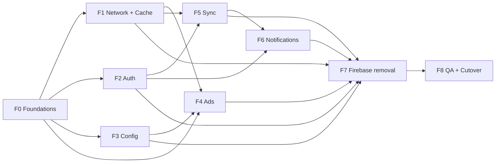

# FlixQuest Flutter — Laravel Migration Implementation Plan

**Document Version:** 1.0
**Branch:** `feat/laravel`
**Status:** F0 implemented and verified against the measured baseline (2026-10-03); F1 implemented and automatically verified (2026-10-03), device smoke pending; F2 implemented and automatically verified (2026-10-03), staging/device smoke pending; F3 implemented and automatically verified (2026-10-03), device/Filament smoke pending; F4–F8 pending
**Sources of truth:**
- `docs/migration_prd_firebase_to_laravel.md` (this repo)
- `~/Documents/web/phplaravel/flixquest-backend` — backend + `docs/migration_phases.md` (Phases 1 & 3 complete)
- `~/Documents/web/flixquest-scraper` — the extraction service covered by Part B
- `docs/firebase_remote_config.md` — exact Remote Config key + occasional-theme v2 semantics
- `docs/codex_handover.md` — repo/working conventions that still apply

**Verified baseline on `feat/laravel` (2026-10-03):**

| Check | Result |
|---|---|
| `.fvm/flutter_sdk/bin/flutter analyze` | 0 issues |
| Full suite | Measured before F0 (2026-10-03): 95 files, 761 passing / 2 existing failures (763 executed); `player_menu_route_test.dart` and `subtitle_options_test.dart` fail as documented in the handover. The earlier 699 declaration estimate was inaccurate. |
| Backend API | Auth, config/bootstrap, ads, all 3 sync engines, devices, announcements, telemetry, Filament — all implemented and Pest-tested |

---

## 0. How this plan works

1. Execute phases in order unless the dependency table says a phase is parallelizable.
2. One branch per phase, branched from `feat/laravel` (e.g. `feat/laravel-f1-cache`). Do not commit, push, or open PRs unless the user asks.
3. At the end of every phase, run:
   ```bash
   .fvm/flutter_sdk/bin/flutter analyze                     # must stay 0 issues
   .fvm/flutter_sdk/bin/flutter test 2>&1 | tr '\r' '\n' | grep -E "Some tests failed|All tests passed" | tail -1
   .fvm/flutter_sdk/bin/dart run build_runner build --delete-conflicting-outputs
   ```
   The full tally before F0 is the regression baseline; F-work must not reduce it (except tests deliberately migrated in the same phase, which must be renamed/replaced 1:1).
4. Use `.fvm/flutter_sdk/bin/flutter` and `.fvm/flutter_sdk/bin/dart` — Flutter is not on PATH (see `docs/codex_handover.md` §2.1).
5. Never run `dart format` on existing hand-formatted files; only on files created in the phase.
6. TV parity is required: every migration phase lists its `lib/tv/**` touchpoints. Do not leave TV on Firebase after the phase that owns that feature.
7. Each phase ends with a short report (what changed, files, test numbers, anything the user must do) and then stops.

This plan has two parts:

- **Part A — Flutter client** (phases F0–F8, §4): the app migration.
- **Part B — `flixquest-scraper` modernization** (repo `~/Documents/web/flixquest-scraper`, phases S0–S4, §5): the scraper stays a pure extraction service, but becomes layered, typed, validated, cache-validator-friendly and ad-free. "Modern architecture" for a TypeScript service means layered modules, typed config + request validation, a consistent error envelope, and HTTP cache validators — not Provider/MVVM/Freezed, which are Flutter concepts. The client-side `ScraperApi` migration is already covered in F1.4/F4.

Cross-repo rules:
- Scraper changes must keep every currently shipped `/api/v2/*` contract working. Wire additions (ETag, extra error fields, new endpoints) are backward-compatible.
- Remove no scraper endpoint before the Flutter phase that stops using it has shipped (ads removal: Flutter F4 → scraper S4).
- One release train per cutover: backend (Laravel) + client (Flutter) + scraper changes that depend on each other ship together.

### Phase dependency graph



F1 and F3/F4 can run in parallel with F2 (different files), but F5 must wait for F2 (it needs bearer tokens), and F6 must wait for F5 (it uses session + sync status).

Scraper phases run in parallel with F0–F2 and join the train at two points: **S3** (cache contract) should land before/with **F1** so the client cache can revalidate, and **S4** (ads removal) must wait for **F4** to ship. All of Part B is independent of the Firebase work.

---

## 1. Target architecture

### 1.1 Layers

```
UI (screens/widgets, unchanged public APIs where possible)
  │  Provider (ChangeNotifierProvider / ProxyProvider)
  ▼
Presentation  lib/presentation/
  ViewModels (ChangeNotifier) + Freezed UI state unions
  │
  ▼
Data          lib/data/
  Repositories — one per backend capability; return Result<T, Failure>
  │
  ├── Sources  remote: LaravelApi · TmdbApi · ScraperApi (Dio)
  │            local:  SQLite controllers (existing) · KVDatabase (SharedPreferences)
  ▼
Core          lib/core/
  Dio factory + interceptors (auth · cache · retry · logging · proxy)
  ResponseCacheStore (SQLite + memory LRU) · CachePolicy registry
  SecureTokenStore · ServerClock · Failure/Result · JsonReader · DI factory
```

Rules:
- Screens never call `http`/`Dio`/Firestore directly (existing violations are removed as each phase touches the file).
- Repositories are the only place that knows backend payload shapes; they convert DTOs ⇄ domain models and map errors to `Failure`.
- ViewModels hold screen state and call repositories. They never import `dio` or `sqflite`.
- `lib/services/*` files become thin adapters while screens migrate, then are deleted.

### 1.2 New directory layout

```
lib/core/
  config/app_environment.dart        # Laravel base URL, timeouts, debug flags
  config/migration_flags.dart        # per-feature cutover switches (development aid)
  di/injector.dart                   # builds stores/clients/repositories once
  error/failure.dart                 # Freezed Failure union
  error/result.dart                  # Freezed Result<T> (Ok/Err)
  json/json_reader.dart              # firstOf() helpers for snake+camel payloads
  network/dio_factory.dart
  network/interceptors/auth_interceptor.dart
  network/interceptors/cache_interceptor.dart
  network/interceptors/retry_interceptor.dart
  network/interceptors/logging_interceptor.dart
  network/interceptors/tmdb_proxy_interceptor.dart
  cache/cache_policy.dart
  cache/cache_policies.dart          # the TTL registry in §1.6
  cache/response_cache_store.dart    # sqflite + memory LRU
  storage/secure_token_store.dart    # flutter_secure_storage
  storage/kv_store.dart              # namespaced SharedPreferences
  time/server_clock.dart             # server_time_utc offset
lib/data/
  models/…                           # Freezed + json_serializable DTOs
  sources/laravel_api.dart
  sources/tmdb_api.dart
  sources/scraper_api.dart
  repositories/auth_repository.dart
  repositories/config_repository.dart
  repositories/ads_repository.dart
  repositories/bookmark_repository.dart
  repositories/recently_watched_repository.dart
  repositories/wellness_repository.dart
  repositories/announcement_repository.dart
  repositories/device_repository.dart
  repositories/telemetry_repository.dart
  repositories/tmdb_repository.dart
lib/presentation/
  session/session_view_model.dart
  bootstrap/bootstrap_view_model.dart
  ...
```

### 1.3 State management: Provider + MVVM

- Keep `provider` — it is already the app's convention and the user asked for Provider.
- New screens/features get a `ChangeNotifier` ViewModel exposed with `ChangeNotifierProvider`; cross-viewmodel dependencies use `ProxyProvider`.
- ViewModel state is a Freezed union, not a pile of nullable booleans:
  ```dart
  @freezed
  sealed class Loadable<T> with _$Loadable<T> {
    const factory Loadable.initial() = LoadableInitial<T>;
    const factory Loadable.loading() = LoadableLoading<T>;
    const factory Loadable.data(T value) = LoadableData<T>;
    const factory Loadable.error(Failure failure) = LoadableError<T>;
  }
  ```
- Existing `ChangeNotifier` providers (`SettingsProvider`, `BookmarkProvider`, `RecentProvider`, `AppDependencyProvider`, `WellnessProvider`, `OfflineDownloadProvider`) are **not rewritten**: they keep their public API and delegate to the new repositories. This keeps 699 tests and every screen working during the migration.

### 1.4 Freezed policy (incremental, not a big-bang rewrite)

Add Freezed now, but apply it where it pays:

| Area | Policy |
|---|---|
| New backend DTOs (`AppUser`, `AuthSession`, `BootstrapConfig`, theme catalog, `BannerAdDto`, sync DTOs, announcements) | **Freezed + json_serializable**, committed generated files |
| ViewModel state (`Loadable<T>`, `SessionState`, `SyncState`) | **Freezed sealed unions** |
| Existing hand-written TMDB/UI models (`Movie`, `TV`, `MovieDetails`, `WellnessViewingSession`, `RecentMovie`…) | Convert **only when the owning phase touches them**; keep `toMap/fromMap` compatibility during conversion |
| SQLite row structs | Stay mutable/manual until their controller is touched (Freezed is awkward for rows updated in place) |

Conventions:
- Enable `explicit_to_json: true` in `build.yaml`.
- Repository/API layer uses `fromJson`; SQLite layer keeps `toMap`/`fromMapObject` (add them to the Freezed class as extension methods where needed).
- Never rename existing model fields in the same step as a Freezed conversion; do it in a separate commit-sized change.
- Generated files are committed. Add to `analysis_options.yaml`:
  ```yaml
  analyzer:
    exclude:
      - "**/*.g.dart"
      - "**/*.freezed.dart"
  ```
- CI/verification runs `build_runner` and fails if the tree is dirty afterwards.

### 1.5 Networking

- Declare `dio` (currently only a transitive dependency) and make it the single HTTP engine.
- Two Dio clients from one factory:
  - **Laravel client** — `AuthInterceptor` (Bearer from `SecureTokenStore`), `ErrorInterceptor`, `RetryInterceptor` (idempotent GET only), `CacheInterceptor` (bootstrap/ads/messages only).
  - **Public client** — TMDB + scraper; cache + retry + logging + `TmdbProxyInterceptor`; no auth.
- Timeouts: connect 10 s. Receive: 20 s metadata, 60 s scraper stream endpoints, 45 s subtitles.
- Legacy `lib/functions/network.dart` keeps its exported function signatures; internals delegate to `TmdbRepository`. This is what makes TMDB caching apply to all 50+ call sites without touching them.
- `ScraperApi` keeps its class name, file and constructor shape (`ScraperApi(baseUrl, {Dio? dio})`) but moves onto Dio + policies. `getAds()` is removed in F4, not earlier.
- `http` stays in `pubspec.yaml` until F7 so untouched files keep compiling; each phase migrates the files it touches.

### 1.6 API response cache (TMDB + scraper + Laravel GETs)

This is the core of the user requirement. One cache engine, per-endpoint policies.

**Store:** `flixquest_http_cache_v1.db` (sqflite, already in the dependency tree)

```sql
CREATE TABLE http_cache (
  key           TEXT PRIMARY KEY,   -- METHOD + normalized URL (params sorted)
  scope         TEXT NOT NULL,      -- 'tmdb' | 'scraper' | 'laravel'
  auth_scope    TEXT NOT NULL DEFAULT 'public', -- 'public' | 'user:<id>'
  status_code   INTEGER NOT NULL,
  headers       TEXT,               -- JSON
  body          BLOB NOT NULL,
  etag          TEXT,
  last_modified TEXT,
  fetched_at    INTEGER NOT NULL,   -- epoch ms (server-corrected where available)
  max_age_ms    INTEGER NOT NULL,
  max_stale_ms  INTEGER NOT NULL
);
CREATE INDEX idx_http_cache_scope ON http_cache(scope, fetched_at);
```

Plus an in-memory LRU (300 entries / 16 MB) in front of SQLite for hot rows.

**Key normalization:** sort query parameters, strip `api_key` and proxy `destination` wrappers (the cache key is computed from the original TMDB URL, so rotating the API key does **not** invalidate the cache). Authenticated Laravel responses include `auth_scope` so user A never receives user B's cached body.

**Interceptor behavior:**
1. Fresh hit → resolve from cache immediately (`extra['cache'] = 'hit'`), no network.
2. Stale hit + network available → send conditional request (`If-None-Match`/`If-Modified-Since`); `304` refreshes `fetched_at` and serves cache; `200` replaces the entry. A background refresh variant (`refreshStale: true`) serves stale now and replaces on completion.
3. Network failure + stale entry within `max_stale` → serve stale (`extra['cache'] = 'stale'`); otherwise rethrow as `Failure`.
4. Never cache: non-GET, status ≠ 200, `Cache-Control: no-store`, `401/403/404/409/422/429/5xx`, stream endpoints.
5. Concurrent identical GETs share one in-flight `Future`.

**Policy registry:**

| Scope | URL pattern (matched in order) | Fresh | Max stale | ETag |
|---|---|---|---|---|
| tmdb | `trending/*`, `discover/*`, `movie/popular`, `movie/upcoming`, `movie/now_playing`, `tv/on_the_air`, `tv/airing_today` | 15 min | 7 d | yes |
| tmdb | `movie/{id}`, `tv/{id}`, credits / videos / images / recommendations / similar / reviews / watch/providers | 24 h | 30 d | yes |
| tmdb | `search/*` | 5 min | 1 d | no |
| tmdb | `genre/*/list`, `configuration/*`, `person/{id}` (24 h) | 7 d / 24 h | 30 d | yes |
| scraper | `providers` | 5 min | 1 d | no |
| scraper | `providers/status` | 60 s | 10 min | no |
| scraper | `subtitles/search` | 24 h | 7 d | no |
| scraper | `stream-movie`, `stream-tv`, `stream-size` | **no cache** | — | — |
| laravel | `config/bootstrap` | revalidate on launch/resume (ETag), offline fallback indefinitely | ∞ | yes |
| laravel | `ads` | 5 min | 24 h | yes |
| laravel | `messages/active` | 15 min | 7 d | yes |
| laravel | all other GETs and every POST/PUT/DELETE | **no cache** | — | — |

**Invalidation API:** `HttpCache.clearScope('tmdb'|'scraper'|'laravel'|'user')`, `clearAll()`, `sizeBytes()`. Settings gains a "Clear cache" row in F1 (small, optional).

**Image caching is unchanged:** `cached_network_image` + `flutter_cache_manager` already handle images; this layer is only JSON responses.

### 1.7 Error handling

All repository methods return `Result<T, Failure>` (Freezed). `Failure` kinds: `network`, `timeout`, `unauthorized`, `forbidden`, `notFound`, `conflict`, `validation(fields)`, `rateLimited(retryAfter)`, `server(status)`, `clockSkew(serverTimeUtc, driftMs)`, `cache`, `unknown`. The Laravel envelope (`success`, `message`, `errors`) is parsed centrally in `LaravelApi`.

### 1.8 Testing strategy

- Baseline suite stays green; each phase adds tests, it does not replace coverage.
- New seams: `Dio` injected into every source/repository; `SecureTokenStore`, `KvStore`, `ServerClock`, `HttpCacheStore` are constructor-injected and faked in tests. New test support lives in `test/support/` (fake Dio adapter, fixtures, fakes).
- Repository tests run against a scripted fake adapter — no network.
- ViewModel tests inject fake repositories.
- Widget tests follow the existing scaffolding (see `docs/codex_handover.md` §7.2) and cover the migrated screens.
- Each sync phase adds a manual two-device smoke script documented in the phase report (no device access from the agent — the user runs it).

### 1.9 Cutover flags and rollback

- `lib/core/config/migration_flags.dart` (read from `--dart-define=FLIXQUEST_MIGRATION=auth,config,ads,sync,...`) controls per-feature cutover during development so both code paths can be tested side by side.
- Production cutover is a single release (F8) because the backend is already complete and tested. Optional remote kill-switches during the transition read from the still-present Firebase Remote Config (`staging` builds only); once F7 lands, rollback is an app-version rollback.
- Each phase must be revertible by reverting its commits: never delete a working path (`FirebaseAuth`, Firestore sync) in the same commit that adds its replacement. Delete only in the phase that declares the Firebase feature dead (F7).

---

## 2. Backend contract reference (as implemented)

Base URL: `/api/v1`; all responses include top-level `success`; resources emit **both snake_case and camelCase** aliases.

### Auth
| Method | URI | Request | Response |
|---|---|---|---|
| POST | `/auth/register` | `name, email, username, password, profile_id/profileId, photo_url/photoUrl` | `201 {success, token, user}` |
| POST | `/auth/login` | `email, password` | `{success, token, user}` · 401 invalid · 422 `requires_password_setup` |
| POST | `/auth/google` | `{access_token}` | `{success, token, user}` · 401 invalid · 409 email exists without google_id |
| POST | `/auth/forgot-password` | `{email}` | generic success (enumeration-safe) |
| POST | `/auth/reset-password` | `{email, token, password/newPassword/new_password}` | success · 422 invalid token |
| GET | `/users/check-username?username=` | — | `{success, available}` |
| GET/PUT | `/user/profile` | `name/fullName, username, profile_id/profileId, photo_url/photoUrl` | `{success, user}` |
| POST | `/user/change-password` | `current_password, password` | success (revokes all tokens) |
| POST | `/user/change-email` | `current_password, email` | success (resets verification) |
| POST | `/auth/logout` | — | success (revokes current token) |
| DELETE | `/user/account` | — | success (cascades all remote data) |

`user`: `{id, name, fullName, email, username, profileId, profile_id, photoUrl, photo_url, provider, isVerified, verified, joinedAt, createdAt, updatedAt}`. Sanctum tokens never expire server-side; they are revoked on password/email change, disable, and account deletion.

### Config
- `GET /config/bootstrap` → `{success, data:{features, branding, updates, network, ads, banners, occasional_theme}}`; supports ETag/304; `Cache-Control: public, no-cache`.

### Ads
- `GET /ads` (optional `?placement=`) → `{success, ads:[{id (string), key, name, imageUrl, targetUrl, altText, shape, aspectRatio, width, height, placements}]}`; ETag/304.
- `POST /ads/{id}/impression`, `POST /ads/{id}/click` → `{success}`; `{id}` accepts numeric id or string key; throttle 120/min.

### Sync
- `POST /sync/bookmarks` — request `{movies[], tvShows[]/tv_shows[], deleted_media[]}`; transactional delete-then-upsert; response `{success, movies, tvShows, tv_shows}` (full merged state).
- `DELETE /sync/bookmarks/{type}/{id}` — `{success, deleted}`.
- `POST /sync/recently-watched` — request `{since_revision? | since_utc?, client_time_utc?, movies[], episodes[]}`; LWW on `updated_at_utc`; 90-day server-side tombstone purge; response `{success, server_revision, serverRevision, server_time_utc, serverTimeUtc, movies[], episodes[]}`; future timestamps > 24 h drift → `422 {error:'clock_skew_detected', server_time_utc, max_drift_ms}`.
- `POST /sync/wellness` — same envelope plus `sessions[]` (client UUID `id`), `daily[]`; pagination `cursor`, `limit` (default 450, max 1000) with `has_more`/`next_cursor`; **uploads are rejected while paginating**; checkpoint ahead of server → 422 requiring a full sync.

### Notifications & telemetry
- `POST /devices/register` (Bearer) — `{fcm_token/fcmToken, platform, app_version/appVersion}`.
- `GET /messages/active` (public) — `{success, messages:[{id, title, body, image_url, action_url, button_text, display_type}]}`.
- `POST /telemetry/errors` (public, optional user) — `error_message, stack_trace, app_version, device_info, occurred_at`.

### Reference resources
`app/Http/Resources/V1/*` and `tests/Feature/*` in the backend are the executable contract. When a payload question comes up during implementation, read the resource + its Pest test rather than the PRD.

---

## 3. Gap analysis — things that must change before/during migration

These are concrete conflicts found between the PRD, the backend as implemented, and the client as it exists today. They are tasks in the phases below; they are listed here because ignoring any of them breaks the migration.

| # | Gap | Impact | Resolution owner | Phase |
|---|---|---|---|---|
| **G1** | **Placement names drifted.** Client uses `home_all_hero/trending/genres`, `home_movies_*`, `home_series_*`, `new_and_hot`, `stream_loading`, `live_tv_top`, `live_tv_list_a/b/c`, `title_detail`, `live_tv_strip`, plus the PRD's legacy 19. Backend `BannerPlacement` enum only contains the legacy 19, so Filament cannot target the newer slots and `?placement=` validation rejects them. | Revenue slots stop being fillable | Backend enum + Filament options; client stops sending invalid `?placement=` | F4 |
| **G2** | **`firebase_core` cannot be removed.** PRD says remove it but retain `firebase_messaging`, which requires `Firebase.initializeApp()` and `google-services.json`. | Build breaks; KPI "≥250 ms faster startup" overstated | Keep `firebase_core` + `firebase_messaging` + google-services; adjust KPI in F8 | F7/F8 |
| **G3** | **Start.io/hosted-ads keys missing server-side.** Client reads `hosted_banner_mode`, `startio_banner_enabled`, `startio_interstitial_enabled`, `startio_interstitial_interval_seconds`, `startio_tv_interstitial_mode`; backend bootstrap/seed does not include them. | Ads engine changes behavior after config cutover | Backend seeder + `ConfigController` mapping | F3 |
| **G4** | **No user model.** Profile is raw Firestore maps read in ~7 screens. | Can't type the new API | Introduce Freezed `AppUser` | F0/F2 |
| **G5** | **`SyncCheckpoint` is Firestore-coupled** (`Timestamp`, `syncedAt`). | Blocks sync migration | Replace with revision-based `SyncCursor` | F5 |
| **G6** | **Clock skew (24 h) is enforced by the backend** but the client has no server-time concept. Blindly pushing local `updated_at_utc` can 422 forever on a wrong device clock. | Sync stalls on skewed devices | `ServerClock` + offset correction + retry-once handler | F0/F5 |
| **G7** | **Wellness cursor rule:** uploads are rejected while paginating. Current client pushes/pulls in one pass. | First large-history sync fails | Repository drains pages, then uploads | F5 |
| **G8** | **Guest→account merge:** today guest wellness uses owner key `guest`; bookmarks/recents sync only when signed in. On first Laravel login, local data must be uploaded and owner remapped. | User loses guest history on signup | Explicit merge step in repositories | F5 |
| **G9** | **Google email collision returns 409** (deliberate backend design, unlike PRD). Client must show "sign in with your password first". | Confusing login failure | Auth screen handling | F2 |
| **G10** | **Firebase uid → Laravel id.** Owner namespace `user:<uid>` and checkpoint keys must not mix old and new data. | False "already synced" state / data loss | New owner namespace + fresh checkpoints on first Laravel login | F2/F5 |
| **G11** | **`AuthSessionController` is a plain UID notifier**, not a session model. | No token/user state for repositories | `SessionViewModel` + adapter | F2 |
| **G12** | **`messages/active` is public** (PRD says Bearer). | Minor | Use public endpoint as implemented | F6 |
| **G13** | **Crashlytics replacement is undecided** (Sentry vs Laravel telemetry endpoint). | Blocks F6 | Decision D2 | F6 |
| **G14** | **Scraper `/api/v2/ads` still exists** (`src/routes/ads.ts`, mount, test, root catalog, boot log) and the repo has no layered architecture: `src/index.ts` is 1,247 lines owning routing + orchestration + caching + validation. | The PRD Phase 2 goal (pure extraction service) is unmet; new client architecture has no service-side counterpart | Part B phases S1/S4 | S4 (after F4) |
| **G15** | **No HTTP cache validators on the scraper** (no `ETag`/`If-None-Match`; core stream routes set no `Cache-Control`; `providers` responses have no explicit policy) and Redis stats/flush use blocking `KEYS`. The Flutter cache layer cannot revalidate. | F1 cache can't do conditional requests against the scraper | Part B phase S3 | S3 (with F1) |
| **G16** | **Scraper repo is mid-merge** (`Merge branch 'v2' into optimize`, resolved but uncommitted, plus staged/unstaged Viv/VidUp work) and CI never runs tests (Node 18/20 vs required Node 22, no `test` script). | Any refactor starts from a dirty, untested tree | Land/stash the merge; Part B S0 adds the test script + CI test step | S0 (before any Part B work) |

**Coordinated backend tasks (do in the backend repo, before the matching Flutter phase):**
1. F3: add `hosted_banner_mode`, `startio_*` keys to `AppConfigurationSeeder` + `ConfigController` bootstrap (`ads` block).
2. F4: extend `BannerPlacement` enum and the Filament multi-select with every placement in G1; optionally normalize existing `home_movies_*` seeds.
3. F5: no backend change required — revisions/cursors are ready.
4. F6: ensure `FIREBASE_CREDENTIALS` is configured in the target environment.
5. F8: staging + production environments on MySQL 8 + Redis (the local SQLite/database-cache config is dev-only).

---

## 4. Part A — Flutter client phase overview

| Phase | Name | Depends on | Size | Primary deliverable |
|---|---|---|---|---|
| **F0** | Architecture foundation | — | S | Dio/Freezed/secure storage/DI/cache scaffolding; zero behavior change |
| **F1** | Network + response cache (TMDB & scraper) | F0 | M | All TMDB + safe scraper GETs cached; `network.dart` delegating to Dio |
| **F2** | Auth, session & account screens | F0 | L | Firebase Auth replaced by Sanctum bearer sessions on phone + TV |
| **F3** | Config bootstrap & seasonal themes | F0 | M | Remote Config replaced by `/config/bootstrap` (ETag, offline) |
| **F4** | Ads cutover & placement reconciliation | F1, F3 + backend G1 | M | Ads served from Laravel; impressions/clicks tracked |
| **F5** | Sync engine | F2 + F1 | L | Bookmarks/recents/wellness on Laravel with revisions, cursors, skew |
| **F6** | Notifications, in-app messages, telemetry | F2, F5 | M | FCM registration, announcements polling, error telemetry, Mixpanel duration |
| **F7** | Firebase removal & native slimming | F1–F6 | S | 6 Firebase packages + native hooks removed (`core`/`messaging` retained) |
| **F8** | QA, staging & cutover | F7 | M | Staging rehearsal, integration matrix, production release |

---

## Phase F0 — Architecture foundation (no behavior change)

### Goal
Land the scaffolding every later phase needs, without changing a single user-visible behavior or the existing provider APIs.

### Milestones

**F0.1 Dependencies & codegen**
- [x] Add `dio`, `flutter_secure_storage`, `freezed_annotation`, `json_annotation`.
- [x] Add dev deps `build_runner`, `freezed`, `json_serializable`.
- [x] `build.yaml`: enable `explicit_to_json: true`; exclude generated files in `analysis_options.yaml`.
- [x] Generate files in the worktree for the user’s eventual commit; document `dart run build_runner build --delete-conflicting-outputs`.
- [x] Run the baseline: record `flutter analyze` (expect 0) and the full `flutter test` tally in this file's header before touching code.

**F0.2 Core primitives** (new files under `lib/core/`)
- [x] `error/failure.dart` — Freezed `Failure` with the kinds in §1.7.
- [x] `error/result.dart` — Freezed `Result<T>` (`Ok`/`Err`) with `map`/`when`/`getOrElse`.
- [x] `json/json_reader.dart` — `firstOf`, `asInt`, `asDouble`, `asBool`, `asString`, `asList`, `asMap`, null-safe and tolerant of snake+camel.
- [x] `config/app_environment.dart` — Laravel base URL from `--dart-define=LARAVEL_API_URL` → `.env` `LARAVEL_API_URL` → debug default `http://10.0.2.2:8000`; add the key to `.env` (there is no `.env.example` today; create one and list all non-secret keys). Note `.env` is bundled as an asset — only non-secret values (the URL) belong there; the existing TMDB key handling stays as-is.
- [x] `config/migration_flags.dart` — per-feature booleans from `--dart-define=FLIXQUEST_MIGRATION` (default: none).
- [x] `storage/kv_store.dart` — namespaced wrapper over `SharedPreferencesSingleton` (typed get/set, `removePrefix`, JSON helpers)
- [x] `storage/secure_token_store.dart` — `flutter_secure_storage` wrapper with `read/write/clear`; constructor-injectable storage backend for tests.
- [x] `time/server_clock.dart` — `recordServerTimeUtc(int)`, `offsetMs`, `nowUtcMs()`, `toServerMs(DateTime)`; offset persisted in `KvStore`.
- [x] `di/injector.dart` — one `Future<AppInjector> buildInjector()` returning an `AppInjector` object holding clients/stores; repositories and Provider wiring are added by their owning phases. No service locator package.

**F0.3 First Freezed DTOs**
- [x] `lib/data/models/app_user.dart` (fields from `UserResource`).
- [x] `lib/data/models/api_error.dart` (`code/message/errors/retryAfter/clockSkew`).
- [x] One smoke Freezed union (`Result`/`Failure`) with round-trip tests.

**F0.4 Test harness**
- [x] `test/support/fake_dio.dart` — scripted `HttpClientAdapter` (queue of `Response`, records requests, can throw `DioException`).
- [x] `test/support/fakes.dart` — `FakeSecureTokenStore`, `FakeKvStore`, `FakeServerClock`.
- [x] `test/support/fixtures/` — auth/user/bootstrap/ads/sync JSON fixtures copied from backend Pest expectations (sanitized).

**F0.5 Verification & docs**
- [x] `analyze` = 0; all pre-F0 passing tests preserved, with the same two pre-existing failures.
- [x] `build_runner` produces generated output kept in the worktree and a second run is a no-op.
- [x] Short doc `docs/flutter_architecture.md` describing the layers/DI/testing conventions (kept small).

### Exit criteria
No behavior change; `dio`, Freezed, secure storage, core primitives, DI and the test harness exist and are unit-tested; the measured existing suite is untouched.

### F0 verification report — 2026-10-03

**Branch:** `feat/laravel-f0-foundation`. No commits, pushes, or PRs were created.

- Added direct Dio, secure storage, Freezed/JSON dependencies and codegen configuration.
- Added environment/flags, Result/Failure, JSON readers, namespaced KV storage,
  secure token storage, persisted server clock, separate public/Laravel clients,
  and injectable lifecycle ownership. Runtime phone/TV providers still use their
  existing paths; the cache engine and feature interceptors belong to F1/F2.
- Added `AppUser`, `ApiError` and nested clock-skew DTOs; all 8 generated files are
  present. Added scripted HTTP/store/clock fakes and sanitized backend fixtures.
- Added architecture and fixture-origin documentation. The ignored local `.env`
  now includes the development Laravel URL; `.env.example` contains placeholders.

| Verification | Result |
|---|---|
| Pre-F0 analysis | 0 issues |
| Pre-F0 full suite | 95 test files; 761 passing / 2 failing (763 executed) |
| New foundation tests | 11 test files; 28/28 passing |
| Final analysis | 0 issues |
| Final full suite | 106 test files; 789 passing / the same 2 failing (791 executed) |
| Live Laravel smoke via Herd | 1/1 passing: bootstrap, ETag/304, ads, messages, profile 401 |
| Repeated `build_runner` | 0 outputs; all 8 generated file hashes unchanged |
| Diff whitespace check | clean |

The complete suite remains red solely because of the pre-existing
`player_menu_route_test.dart` and `subtitle_options_test.dart` failures already
recorded in the handover. Those files and all other existing tests are untouched.
This report verifies F0 against the measured baseline; it does not claim a fully
green global suite. No backend source changes or device interaction were needed.

Reproduce the explicit read-only backend smoke with:

```bash
.fvm/flutter_sdk/bin/flutter test integration/laravel_foundation_smoke_test.dart \
  --dart-define=LARAVEL_SMOKE_URL=http://flixquest-backend.test
```

No app restart or backend setup is required for F0. Configure a device-reachable
Laravel URL when wiring feature cutovers. F1 is the next phase; work stops here as
specified by the phase boundary.

### Rollback
Revert the phase branch. Nothing in the running app imports the new code yet.

---

## Phase F1 — Network stack + API response cache (TMDB & scraper)

### Goal
Every TMDB metadata call and every cache-safe scraper call goes through one Dio client with a persistent, policy-driven response cache. Stream endpoints remain uncached and untouched.

### Milestones

**F1.1 Dio foundation**
- [x] `core/network/dio_factory.dart`: `createPublicDio(...)` and `createLaravelDio(...)`.
- [x] `HeaderInterceptor` (Accept, gzip, platform UA), `RetryInterceptor` (GET + idempotent only; 2 retries; 300 ms × 2ⁿ; gives up on 4xx), `LoggingInterceptor` (debug builds only, redacts tokens), `ErrorInterceptor` (`DioException` → `Failure`).
- [x] `TmdbProxyInterceptor` — centralizes the current `?destination=$proxyUrl` logic from `lib/functions/network.dart`; applies only to TMDB hosts.
- [x] Keep the existing `retryOptions` behavior semantics (`SocketException`/`TimeoutException` retried).

**F1.2 Response cache**
- [x] `core/cache/cache_policy.dart` + `cache_policies.dart` (exact table in §1.6).
- [x] `core/cache/response_cache_store.dart` — sqflite `flixquest_http_cache_v1.db`, schema + migrations, memory LRU, `get/put/touch/evict/clearScope/clearAll/sizeBytes`, `pruneExpired()`.
- [x] `core/cache/cache_interceptor.dart` — fresh-hit, conditional revalidation, stale-serve-on-failure, `refreshStale` background mode, in-flight dedupe, cache-key normalization (sorted params, strip `api_key`/`destination`), `auth_scope`, and `extra['cache']` diagnostics.
- [x] Unit tests for store + interceptor with the fake adapter: fresh/stale/expired, ETag 304, offline fallback, non-GET bypass, error-status bypass, scope clearing, concurrent dedupe, API-key rotation, param-order normalization.

**F1.3 TMDB migration**
- [x] `data/sources/tmdb_api.dart` — `getJson(String url, {CachePolicy policy})` (URLs still built by `Endpoints`).
- [x] `data/repositories/tmdb_repository.dart` — thin wrapper used by `network.dart` and `catalog/*`.
- [x] Rewrite `lib/functions/network.dart` internals to delegate (public function signatures unchanged). All `fetchMovies/fetchTV/fetchGenre/...` call sites are automatically cached.
- [x] Route `lib/catalog/title_logos.dart` and `lib/widgets/app_logo.dart` through Dio + long TTL.
- [x] Tests: the second identical `fetchMovies` call hits cache (fake adapter called once); offline second call returns cached data; proxy still applied; `TMDB_API_KEY` rotation served from cache.

**F1.4 Scraper migration**
- [x] Refactor `video_providers/scraper_api.dart` onto Dio with per-endpoint policies. Stream/`stream-size` requests set `CachePolicy.noStore`.
- [x] `providers`, `providers/status`, `subtitles/search` cached per §1.6.
- [x] Tests: stream endpoints never cached; providers cached; 60 s stream timeout preserved; existing `test/scraper_api_test.dart` migrated to the Dio seam.

**F1.5 Cache management**
- [x] `HttpCache.pruneExpired()` at boot (idle).
- [x] Existing Settings clear-cache action also clears HTTP responses. No additional size row was added (optional).
- [x] Bounded cache: max 5 000 entries / 50 MB, LRU eviction.

**F1.6 Verification**
- [x] No new full-suite failures against the measured baseline; `test/tv_*.dart` green.
- [ ] Manual: fetch Home, kill network, relaunch → cached rows render; Play still loads streams (uncached).

### Exit criteria
No new network call bypasses Dio in touched files; TMDB and safe scraper GETs are served from a persistent cache with offline fallback; analyze 0; no new failures against the measured suite baseline. Device smoke remains a user-run check.

### F1 verification report — 2026-10-03

**Branch:** `feat/laravel-f1-cache`, based on the user's committed F0. No commits,
pushes, PRs, backend edits or device interaction were performed.

- Selected `dio_cache_interceptor` for HTTP validation/serialization (D3).
  FlixQuest adds the endpoint TTL registry, SQLite persistence, bounded memory LRU,
  user namespaces, normalized keys, background refresh and shared in-flight GETs.
- Wired the shared injector/Provider and legacy network bridge at boot. Phone and
  TV use the same TMDB/scraper engine. Public TMDB function signatures and DTO
  parsing remain compatible; title logos and validated remote SVGs use Dio.
- Migrated all nine existing scraper tests and the existing logo/TV browse seams
  to injected Dio, preserving their assertions. Streams/size requests bypass the
  cache, with stream/subtitle timeouts preserved. Vix retains its original single
  attempt; metadata gets the planned two retries instead of unbounded retries.
- Added tests for fresh/stale/expired responses, ETag 304 (both Dio status paths),
  offline fallback after SQLite reopen, API-key/proxy/query normalization,
  non-GET/error/no-store bypass, user clearing, concurrent cancellation, background
  refresh, in-flight clearing/retries, entry/byte bounds and LRU timestamp ties.
- Herd smoke now also verifies automatic bootstrap revalidation returns the
  cached JSON after Laravel's 304. No backend source changes are required.

| Verification | Result |
|---|---|
| New F1 tests | 6 files; 45/45 passing |
| Final analysis | 0 issues |
| Final full suite | 112 files; 834 passing / the same 2 existing failures (836 executed) |
| TV tests (`test/tv_*.dart`, within full suite) | 129/129 passing |
| Live Herd smoke | 1/1 passing, including automatic bootstrap ETag revalidation |
| Repeated `build_runner` | 0 outputs; all 10 tracked generated files unchanged from F0 HEAD |
| Diff whitespace check | clean |

The two existing failures remain `player_menu_route_test.dart` (episodes route)
and `subtitle_options_test.dart` (incoming subtitle order). Neither file was
modified, skipped or weakened. A playback-loader layout test now uses its existing
fake-ad seam so the newly asynchronous Dio transport does not leave timers pending;
all its layout assertions and test names are preserved.

F1's automated implementation is complete. The device check below remains
unchecked, and work stops at this phase boundary.

User-run device smoke (no device access by the agent):

1. After fetching dependencies, hot restart with **R**. Browse Home and title
   details online on phone and TV.
2. Disable networking, close/relaunch the app, and confirm previously visited
   metadata renders from SQLite within the configured offline limit.
3. Restore networking and play a movie/TV episode; confirm stream extraction still
   runs. Use Settings → Clear cache, restart offline, and confirm HTTP rows have
   been cleared.

The deterministic offline/restart test verifies the persistence path; it does
not claim this device smoke was performed. F2 auth is the next phase.

### Rollback
Revert. Firebase paths are untouched in this phase.

---

## Phase F2 — Auth, session & account screens

### Goal
Replace `firebase_auth` and the raw Firestore profile reads with Laravel Sanctum sessions and a typed `AppUser`, on phone and TV, including guest browsing.

### Milestones

**F2.1 Data layer**
- [x] Freezed DTOs: `AppUser`, `AuthSession {token, user}`, `RegisterRequest`, `LoginRequest`, `UpdateProfileRequest`, `ChangePasswordRequest`, `ChangeEmailRequest`.
- [x] `data/sources/laravel_api.dart` — all auth/profile endpoints from §2; central envelope parsing; `Failure` mapping incl. `requires_password_setup`, 409 Google conflict, 403 disabled, 429 throttle with `Retry-After`.
- [x] `data/repositories/auth_repository.dart` — thin methods returning `Result<T>`.
- [x] Tests: repository contract with fixtures for every status above; token never logged.

**F2.2 Session**
- [x] `presentation/session/session_view_model.dart` — Freezed `SessionState {initializing, guest, authenticated(AppUser), expired}`.
  - `restore()` at boot: token present → `GET /user/profile`; 401 → clear + guest.
  - `signIn`, `signUp` (then guest-data merge hook, wired in F5), `signInWithGoogle(accessToken)`, `signOut`, `deleteAccount`.
  - Persist token in `SecureTokenStore`; expose `ValueNotifier<String?>` for owner-key consumers.
- [x] `AuthInterceptor` attaches `Authorization: Bearer`; on 401 clears token and flips state to `expired` once (no retry storm).
- [x] Rebuild `AuthSessionController` as an adapter over `SessionViewModel` (`userId` ValueNotifier, `setAuthenticatedUserId` no-op shim) so untouched screens keep compiling.
- [x] Owner namespace decision: persisted owner id becomes `user:<laravelId>`; old `user:<firebaseUid>` local rows are left in place and handled by the F5 merge (never silently reused).

**F2.3 Google Sign-In**
- [x] `google_sign_in` → `accessToken` (fallback `idToken`) → `POST /auth/google` `{access_token}`.
- [x] Handle 409 with a clear message: "This email already has a password account. Sign in with your password first." (backend does not auto-link).
- [x] Keep `GoogleSignIn.signOut()` on sign-out; remove `FirebaseAuthProvider` credential code.
- [x] Tests with a fake Google client.

**F2.4 Screens (phone + TV)**
- [x] Phone: `landing_screen.dart`, `login_screen.dart`, `signup_screen.dart`, `forgot_password.dart`, `password_change.dart`, `email_change.dart`, `delete_account.dart`, `edit_profile.dart`, `sync_screen.dart`, `my_flixquest_screen.dart`, `user_state.dart`/`auth_navigation_service.dart` wiring.
- [x] TV: `tv_landing_screen.dart`, `tv_auth_screen.dart`, `tv_profile_screen.dart`.
- [x] Replace every raw Firestore `users` read (`edit_profile`, `email_change`, `delete_account`, `tv_profile_screen`, `my_flixquest_screen`) with `SessionViewModel`/`AuthRepository`.
- [x] Forgot password uses `POST /auth/forgot-password`; the email links to the backend web form — no in-app token screen is needed.
- [x] Username availability uses `GET /users/check-username`.
- [x] Delete account: `DELETE /user/account` + local wipe (existing local wipe logic reused).
- [x] Remove `FirebaseAuth` imports from all touched screens; `firebase_auth` stays in `pubspec.yaml` until F7.
- [x] Widget tests: login success/401, signup username taken, forgot flow, expired session routes to landing, TV auth smoke, guest browse.

**F2.5 Backend-first verification**
- [ ] On staging, log in with a migrated Firebase-Scrypt account; confirm `users.password` became `$2y$…` after first login and the second login is Bcrypt (backend Pest already covers this; the client test proves the request shape).
- [x] Confirm 401 from a revoked token (password change) routes the app to landing.

### Exit criteria
No `firebase_auth` or Firestore-profile call remains on the auth/profile/TV paths; sessions persist across restarts; expired tokens log out cleanly; suite green.

### F2 verification report — 2026-10-03

**Branch:** `feat/laravel-f2-auth`, based on the user's committed F1. No commits,
pushes, PRs, backend source changes or device interaction were performed.

- Added typed auth requests/session, the Laravel auth repository, Google token
  exchange, secure token persistence, profile persistence, and a shared session
  gate for phone and TV. Account endpoints explicitly bypass HTTP caching.
- Boot validates a stored token against `/user/profile`; an offline boot can use
  only the profile matching its persisted Laravel owner. Guest browsing requires
  no request or anonymous account. Owners use `user:<laravelId>`.
- Protected 401 responses expire the session once and dismiss account routes.
  Public login failures do not expire a current session. Revision checks prevent
  late storage reads, writes, logout responses, or old-token rejections from
  overwriting a newer login. Password changes clear the revoked session;
  email changes retain it, matching the actual backend contract.
- Migrated the specified phone/TV auth and profile routes. Username checks and
  password-reset emails use Laravel. Profile editing uses `AppUser` and updates
  the mounted account header. Account deletion wipes local libraries and the
  deleted Laravel owner's wellness rows, then reloads the providers.
- Preserved all 15 original auth/profile files under `lib/legacy/firebase_auth/`;
  verified their bodies match F1 exactly apart from imports. Public routes choose
  them when the auth flag is off. With Laravel auth enabled, Firebase sync cannot
  run; libraries remain local until F5. Legacy Firebase and guest wellness rows
  stay separate and are not silently merged into Laravel owners.

| Verification | Result |
|---|---|
| New F2 tests | 7 files; 70/70 passing (including 8 widget flows) |
| Final analysis | 0 issues |
| Full suite | 119 files; 904 passing / the same 2 existing failures (906 executed) |
| Herd backend auth tests | 29/29; 128 assertions, including first Scrypt login → Bcrypt and second login |
| Backend account/reset compatibility tests | 42/42; 212 assertions across `MigrationReadinessTest`, `MobileCompatibilityTest`, and `PasswordResetTest` |
| Live Herd read-only checks | username availability 200; unauthenticated profile 401 |
| Generated files | 5 new Freezed/JSON files; all 10 pre-existing generated files unchanged |
| Diff whitespace check | clean |

The existing failures remain `player_menu_route_test.dart` (episodes route) and
`subtitle_options_test.dart` (incoming subtitle order). Neither file was modified,
skipped or weakened. The backend tests use the configured isolated SQLite
in-memory test database; no real accounts were created or changed.

F2's automated implementation is complete. The migrated-account staging login
and phone/TV device checks remain pending; no staging credentials were provided.
The fake Google plugin verifies access-token preference, ID-token fallback,
cancellation, and logout; an actual Google login still needs device verification.
The backend's Socialite exchange expects an OAuth access token, so the ID-token
fallback has only been verified at the client request boundary.

User-run smoke (no device access by the agent):

1. Start a phone/TV build with `--dart-define=FLIXQUEST_MIGRATION=auth` and
   `--dart-define=LARAVEL_API_URL=<reachable backend URL>`. Herd's local `.test`
   hostname needs a reachable host/network address on a physical device.
2. Sign in with a migrated account; verify the backend password becomes `$2y$…`
   after the first login and confirm the second login. Close/relaunch the app and
   confirm the session restores. Check Google sign-in and the password-account
   conflict message on a supported device.
3. Edit the profile and email, send a password-reset email, and complete its
   backend web form. Change the password and confirm the app returns to landing.
   Check local guest browsing offline. Use a disposable account for deletion.
4. Restart with `auth` removed from the migration flag and verify Firebase
   rollback. Cloud sync under Laravel remains unavailable until F5.

Work stops at F2; F3 config bootstrap is the next phase.

### Rollback
`migration_flags.auth` off → old Firebase auth path still present until F7 (do not delete Firebase auth code in F2; delete in F7).

---

## Phase F3 — Config bootstrap & seasonal themes

### Goal
Replace `firebase_remote_config` with `/api/v1/config/bootstrap` + ETag + SharedPreferences cache, keeping `AppDependencyProvider` as the single consumer.

### Prerequisite (backend repo)
- [x] **G3:** add `hosted_banner_mode`, `startio_banner_enabled`, `startio_interstitial_enabled`, `startio_interstitial_interval_seconds`, `startio_tv_interstitial_mode` to `AppConfigurationSeeder` and the `ads` block of `ConfigController@bootstrap`; ship seed tests.

### Milestones

**F3.1 DTOs & repository**
- [x] Freezed `BootstrapConfig` with `FeaturesConfig`, `BrandingConfig`, `UpdateConfig`, `NetworkConfig`, `AdsConfig`, `BannerDisplayConfig`, `OccasionalThemeCatalog` + `OccasionalTheme` + `ThemeEffect`.
- [x] Parsing must preserve the exact v2 semantics in `docs/firebase_remote_config.md`: aliases (`xmas`, `ethiopian-new-year`, `enkutatash`, `valentine`…), `starts_at`/`ends_at`, priority, `user_selectable`, `default_theme_id`, `active_theme_id`, dual-color `colors[]` entries, `effect.enabled`, `effect_type` list, presets for invalid entries.
- [x] `data/repositories/config_repository.dart` — `GET /config/bootstrap` with ETag persisted in `KvStore` (`config.bootstrap.etag`), raw JSON persisted under the existing `AppDependencies` keys (`FLIXQUEST_LOGO_URL`, `FLIXQUEST_API_URL(S)`, `TMDB_PROXY`, `OCCASIONAL_THEME*`, update keys) so rollback and offline boot keep working.
- [x] `RefreshController`: refresh on boot, on app resume if older than 1 h, and after a push-data config hint; 304 keeps the persisted payload.
- [x] Tests: parse fixture from the backend contract test; 304 path; offline uses last payload; empty cache uses safe defaults (`features.* = true`); theme window/priority/alias parity tests ported from `test/occasional_theme_provider_test.dart`.

**F3.2 Consume in `AppDependencyProvider`**
- [x] Replace `AppRemoteConfig.apply(config, provider)` with `BootstrapViewModel` pushing into the existing setters (`setBannerConfigs`, `setBannerAdNetwork`, `setHostedBannerMode`, `setUnityAdsConfig`, `setStartIoAdsConfig`, `setFlixquestApiConfig`, `setUpdateConfiguration`) — this is the single choke point identified in `lib/provider/app_dependency_provider.dart`.
- [x] TMDB key: keep `TMDB_API_KEY` runtime setter in `lib/constants/api_constants.dart`; bootstrap supplies the same key as Remote Config did.
- [x] `bootstrap` also feeds the **network config** (scraper instances list) used by `HostedAdsRepository`/`ScraperApi` callers.
- [x] Rewire `flixquest_main.dart` `_initConfig` to the new controller; delete the `FirebaseRemoteConfig` code there. Keep `firebase_remote_config` in pubspec until F7.

**F3.3 Theme engine**
- [x] Keep `AmbientThemeService` and the particle overlay; feed them from the new catalog.
- [x] Preserve user selection persistence and boundary timers; honor server-computed `active_theme_id` (the backend already resolves windows/priority).
- [x] Tests: existing theme tests migrated 1:1; add offline theme boot.

**F3.4 Verification**
- [ ] Airplane-mode cold boot: cached config renders, features default true, no blank screens.
- [ ] Change a feature toggle in Filament → refresh → app reflects it; ETag 304 on second launch (verify via logs).

### Exit criteria
`FirebaseRemoteConfig` is no longer used; bootstrap is the only config source; offline boot is safe; analyze 0; suite green.

### F3 verification report — 2026-10-03

**Branch:** `feat/laravel-f3-config`, based on the user's committed F2. The
Laravel G3 prerequisite is implemented in the backend checkout. No commits,
pushes, PRs, real database seeding, or device interaction were performed.

- Added typed bootstrap DTOs, a config repository, a bootstrap view model, and
  one controller for boot/resume/push refresh. `AppDependencyProvider` remains
  the consumer for phone, tablet and TV, including scraper instances, TMDB
  key/proxy, updates, banner display rules, and Start.io pacing.
- Hydrates the persisted snapshot before rendering and fetches asynchronously
  at boot. Resume refreshes after one hour; `type=config_updated`,
  `type=config_refresh`, or `refresh_config=true` FCM data requests an immediate
  refresh. Concurrent lifecycle calls share a request; a hint during a request
  schedules another validation. Disposed controllers ignore late UI updates.
- The repository owns its persistent payload/ETag pair and bypasses the HTTP
  response cache to avoid competing validators. It mirrors the ETag at
  `config.bootstrap.etag` and config into existing `AppDependencies` keys.
  A 304 retains the payload; transport/envelope failures retain the snapshot.
  Without a Laravel snapshot, offline startup reads legacy config and defaults
  all features to true. Invalid seasonal updates retain the previous catalog
  while valid feature changes apply. Empty backend catalogs are supported.
- Kept the existing theme engine, ambient service, particle overlay, selection
  persistence and boundary timers. DTOs use the same parser for aliases,
  custom dual-color palettes, presets, effects, dates and priority. A server
  active theme guides automatic selection until the next local boundary;
  explicit user selection still wins. The original theme/provider tests are
  retained unchanged, preserving every assertion 1:1, with additional Laravel
  DTO parity and offline restart coverage.
- Removed Firebase Remote Config setup/listeners from `flixquest_main.dart`.
  The isolated `lib/legacy/firebase_config_controller.dart` retains the
  `AppRemoteConfig` rollback when the config migration flag is off. Firebase
  packages remain until F7; F4 hosted-ad transport is unchanged.
- Backend G3 adds the five hosted/Start.io fields to the bootstrap response and
  default seeder. Defaults keep Start.io disabled and use hosted `stack` mode.
  Seed tests verify operator values survive reseeding. Both repositories keep
  the same sanitized fixture, verified by Laravel's exact JSON response test
  and Flutter's typed parser.

| Verification | Result |
|---|---|
| New F3 tests | 5 files; 31/31 passing |
| F3 plus retained theme/provider tests | 49/49 passing; 18 existing tests unchanged |
| Final analysis | 0 issues |
| Full suite | 124 files; 935 passing / the same 2 existing failures (937 executed) |
| Herd backend config tests | 22/22; 244 assertions across `BootstrapAdsConfigTest` and `ConfigBootstrapTest` |
| Live Herd read-only checks | bootstrap 200 with all five G3 fields; conditional GET 304 with empty body |
| Code generation | two new outputs; repeat build wrote 0 outputs; all 15 pre-existing generated files unchanged |
| Diff whitespace checks | clean in both repositories |

The existing failures remain `player_menu_route_test.dart` (episodes route) and
`subtitle_options_test.dart` (incoming subtitle order). Neither file was changed,
skipped or weakened. The four repository lint fixes after the full run only
added braces; final analysis and all 49 focused tests passed afterward.
The backend tests used the isolated SQLite in-memory test database. No real
configuration, theme or account was created/changed. `test/_preview/` is absent;
no visual/device previews were performed because the phase keeps the existing
mobile/TV theme rendering. F3's automated implementation is complete; the two
manual F3.4 checks remain pending.

Flutter files added: `lib/data/models/bootstrap_config.dart` and its two
Freezed/JSON outputs; `lib/data/repositories/config_repository.dart`;
`lib/presentation/config/bootstrap_view_model.dart`;
`lib/presentation/config/refresh_controller.dart`;
`lib/legacy/firebase_config_controller.dart`; five test files under `test/data`,
`test/presentation` and `test/core`; `test/support/fixtures/bootstrap_config.json`.
Changed: `lib/core/di/injector.dart`, `lib/main.dart`, `lib/flixquest_main.dart`,
`lib/models/occasional_theme.dart`, `lib/services/in_app_messaging_service.dart`,
and this plan. No files deleted.

Backend files changed: `app/Http/Controllers/Api/V1/ConfigController.php` and
`database/seeders/AppConfigurationSeeder.php`. Added:
`tests/Feature/BootstrapAdsConfigTest.php` and
`tests/Fixtures/bootstrap_config.json`. Existing unrelated backend changes
remain untouched.

User-run smoke (pending; no device access by the agent):

1. Start a phone/TV build with `--dart-define=FLIXQUEST_MIGRATION=auth,config`
   and `--dart-define=LARAVEL_API_URL=<reachable backend URL>`. A changed
   dart-define requires restarting the Flutter process; **R** suffices only
   if the running process already has these defines. Do not use Herd's local
   `.test` hostname on a physical device unless it resolves there.
2. Confirm online bootstrap, updates, scraper selection and seasonal theme;
   choose another available theme and turn its effects off. Disable networking,
   close/relaunch and confirm config and user preferences are retained.
3. Change a feature in Filament, resume after an hour or send the documented
   config hint, and confirm the provider updates. Relaunch unchanged config
   and confirm an HTTP 304 in the debug network logs.
4. For admin editing, run `herd php artisan db:seed --class=AppConfigurationSeeder`
   in the backend checkout on the intended environment to create the five
   new settings. The API supplies safe defaults
   even before seeding; no real database was seeded during this phase.
5. Remove `config` from the migration flag to verify the Firebase rollback.

Work stops at F3; F4 ads cutover is the next phase.

### Rollback
`migration_flags.config` off → `AppRemoteConfig` path still present until F7.

---

## Phase F4 — Ads cutover & placement reconciliation

### Goal
Serve all hosted banners from Laravel, track impressions/clicks, and delete the scraper `/ads` path — without losing a single revenue slot.

### Prerequisite (backend repo)
- [ ] **G1:** extend `BannerPlacement` with every live client placement (list below) and add them to the Filament multi-select; deploy before the client switches.
  `home_all_hero`, `home_all_trending`, `home_all_genres`, `home_movies_hero`, `home_movies_trending`, `home_movies_genres`, `home_series_hero`, `home_series_trending`, `home_series_genres`, `movie_list`, `tv_list`, `streaming_movies`, `streaming_tv`, `movie_detail`, `tv_detail`, `season_detail`, `episode_detail`, `collection_detail`, `person_detail`, `bookmarks`, `downloads`, `new_and_hot`, `stream_loading`, `live_tv_top`, `live_tv_list_a`, `live_tv_list_b`, `live_tv_list_c`, `discover_movies`, `discover_tv`, `genre_movies`, `genre_tv`, plus TV tags `title_detail_tv`, `live_tv_strip_tv`.
- [ ] Decide with the user whether to alias legacy `home_movies`/`home_tv` to the new `home_*_*` slots or keep both (recommend: keep both, priority-based).

### Milestones

**F4.1 Ads data layer**
- [ ] `BannerAdDto` Freezed; `AdsRepository` (one shared `GET /ads` fetch per app session, 5 min fresh / 24 h stale via cache; local `appliesTo` filtering unchanged, so one fetch serves every slot).
- [ ] `reportImpression(id)` / `reportClick(id)` — fire-and-forget with an offline queue in SQLite (`ad_events`: id, ad_id, type, created_at, sent); flush at boot and on reconnect; drop events older than 7 days.
- [ ] Tests: shared fetch, queue flush, dedupe impression per ad per screen view, click on tap, 404 tolerated.

**F4.2 Widget refactor**
- [ ] `HostedAdsRepository` delegates to `AdsRepository` (keep `useFetcherForTesting`); `RemoteHostedAdsBanner` behavior unchanged (carousel, `HostedBannerMode`, Start.io coexistence).
- [ ] Add visibility-based impression (≥50% visible for ≥1 s, once per ad per mount) and click reporting in `HostedAdsBanner._open`.
- [ ] Port `test/hosted_ads_coexistence_test.dart` and the placement-matching tests.

**F4.3 Scraper cleanup**
- [ ] Delete `ScraperApi.getAds()` and its parsing code (`lib/video_providers/scraper_api.dart`).
- [ ] Delete the scraper ads fixtures/references in this client repo; the scraper repo's `/ads` removal is backend Phase 2 (separate repo, coordinate).
- [ ] Add a regression test that no `RemoteHostedAdsBanner` placement string is missing from a checked-in placement manifest (`lib/data/ads/placements.dart`), and a test that compares it to the backend enum values copied into `test/support/fixtures/banner_placements.json`.

**F4.4 Verification**
- [ ] Filament shows impression/click increments from a debug device.
- [ ] Every placement renders its intended ad or nothing (never a broken slot); TV `_tv` tags still match.
- [ ] `grep -rn "getAds" lib` returns nothing.

### Exit criteria
Hosted ads come exclusively from Laravel; impressions/clicks recorded; placement manifest matches backend; scraper no longer serves ads from the client's perspective.

### Rollback
`migration_flags.ads` off restores the scraper fetcher (keep it until F7).

---

## Phase F5 — Sync engine (bookmarks, recently watched, wellness)

### Goal
Replace Firestore's union-merge/LWW sync with the Laravel batch endpoints, using revisions + cursors + clock-skew handling, and migrate guest data on first login.

### Milestones

**F5.1 Bookmarks**
- [ ] Freezed `BookmarkDto` (or keep the legacy `Movie`/`TV` models with explicit mapping) + `BookmarkRepository`.
- [ ] `sync(movies, tvShows, deletedMedia)` → `POST /sync/bookmarks`; response union-merged into SQLite with the existing genre-backfill behavior (`_keepGenres`).
- [ ] `deleteMedia(type, id)` → `DELETE /sync/bookmarks/{type}/{id}`.
- [ ] Keep `BookmarkSyncService` public API (`init`, `onBookmarkChanged`, `statusNotifier`, `lastSyncedNotifier`) as an adapter; delete Firestore internals.
- [ ] Debounce 3 s, auto-sync 10 min (existing constants preserved).

**F5.2 Recently watched**
- [ ] Convert `RecentMovie`/`RecentEpisode` mapping to the backend field names (add `sync_revision`, `synced_at_utc` handling); keep SQLite columns.
- [ ] `RecentlyWatchedRepository.sync(...)` → `POST /sync/recently-watched` with `since_revision` (preferred) and `client_time_utc`.
- [ ] Replace `SyncCheckpoint` with `SyncCursor` in `KvStore` (per user): `serverRevision`, `lastServerTimeUtc`, `lastSyncAt`, `lastFullPullAt`; full pull every 7 days, or when the server replies `since_revision` ahead / requires full sync.
- [ ] `ServerClock.record(serverTimeUtc)` on every sync; outgoing `updated_at_utc` stamped through the corrected clock; on `422 clock_skew_detected` record server time, recompute offset, retry once, then surface an error.
- [ ] Keep debounce 5 s, auto-sync 2 min, flush on background (`flushPending`), 450-row batches, local tombstone pruning (server prunes at 90 d).
- [ ] Port `test/recent_watched_sync_test.dart` and `test/sync_checkpoint_test.dart` to the new cursor/revision semantics; add skew-retry and revision-ahead full-sync tests.

**F5.3 Wellness**
- [ ] `WellnessRepository`:
  1. Upload pass: pending sessions (`synced=0`) + daily ledger diff (`planDailyWrites` unchanged).
  2. Pull pass: paginate `cursor`/`limit: 450` until `has_more == false` (never upload while paginating); LWW-merge; reseed the daily ledger after a full pull.
- [ ] `WellnessProvider` owner key derived from `SessionViewModel` (`guest` / `user:<laravelId>`); session-level Freezed conversion of `WellnessViewingSession` optional — keep `toMap/fromMap` and add backend mapping only.
- [ ] `deleteRemoteAccountData` becomes `DELETE /user/account` (server cascade) + local wipe.
- [ ] Tests: pagination drain, upload-after-drain ordering, LWW, tombstone handling, ledger reseed, `network_bytes` round-trip.

**F5.4 Guest → account first-login merge**
- [ ] On successful register/login with existing guest data: remap local owner (`guest` → `user:<laravelId>`), mark rows pending, run bookmarks + recents + wellness sync immediately, then clear the guest namespace.
- [ ] Verify deletion of an account removes server data (cascade) and does not resurrect on next login.

**F5.5 Adapters & cleanup**
- [ ] `RecentlyWatchedSyncService`/`WellnessSyncService` become adapters; remove `cloud_firestore` imports from all three services and from `sync_screen.dart`.
- [ ] `sync_checkpoint.dart` deleted after all callers move (grep first).
- [ ] `RecentlyWatchedSyncService` pull/push lifecycle callbacks in `flixquest_main.dart` re-pointed at repositories.

**F5.6 Two-device verification (user-run)**
- [ ] Device A and B signed into the same account; play different titles; confirm both devices converge with LWW (newest `updated_at_utc` wins).
- [ ] Delete an item on A → B removes it after sync (tombstone).
- [ ] Set A's clock 25 h fast → sync returns 422, app records server time and recovers on the next sync without data loss.

### Exit criteria
No Firestore import remains in `lib/services/*sync*`, `lib/provider/wellness_provider.dart`, or `sync_screen.dart`; LWW/delta/pagination verified on staging; guest merge works; suite green.

### Rollback
Revert the phase branch; Firestore code remains until F7.

---

## Phase F6 — Notifications, in-app messages & telemetry

### Goal
Register FCM tokens with Laravel, poll announcements instead of FCM data payloads, replace Crashlytics, and route streaming-duration analytics to Mixpanel.

### Milestones

**F6.1 Device push registration**
- [ ] `DeviceRepository.register(fcmToken, platform, appVersion)` → `POST /devices/register`; call after login and on `FirebaseMessaging.onTokenRefresh`; skip when guest.
- [ ] Persist last registered token in `KvStore` to avoid duplicate calls; re-register on boot when signed in.
- [ ] Keep `FirebaseMessaging.onBackgroundMessage` in `main.dart` (retained FCM).
- [ ] Tests: payload shape (snake + camel accepted), no-op for guests, refresh re-registers.

**F6.2 In-app messages**
- [ ] `AnnouncementRepository.fetchActive()` → `GET /messages/active` (15 min cache); poll on resume + cold start (throttled), and still accept FCM `data.type == 'in_app_message'` payloads.
- [ ] `InAppMessagingService` builds `InAppMessagePayload` from either source; dedupe by announcement `id` in `KvStore` so a message is not shown twice.
- [ ] `InAppMessageDialog` unchanged.
- [ ] Tests: both sources, dedupe, display types modal/bottom_sheet/banner.

**F6.3 Telemetry**
- [ ] Decision D2: adopt **Sentry Flutter** (`sentry_flutter`) for crash/fatal reporting (recommended: real crash quality, release health) and keep `POST /telemetry/errors` for non-fatal breadcrumbs; or use the Laravel endpoint for both. Document the choice and the DSN/config.
- [ ] Remove `FirebaseCrashlytics` from `main.dart`; keep the `_isRecoverableImageError` filter.
- [ ] `updateAndLogTotalStreamingDuration` in `lib/functions/function.dart` → `AnalyticsService.trackStreamingDuration(seconds)` (Mixpanel). Remove the `firebase_analytics` import.
- [ ] Tests: error handler does not recurse on reporter failures; event name/payload asserted.

### Exit criteria
Crashlytics and Firebase Analytics imports are gone from code; device tokens registered; announcements render from both sources; suite green.

---

## Phase F7 — Firebase removal & native build slimming

### Goal
Remove dead Firebase packages and native hooks — while keeping FCM working (G2).

### Milestones

**F7.1 `pubspec.yaml`**
- [ ] Remove: `cloud_firestore`, `firebase_auth`, `firebase_crashlytics`, `firebase_remote_config`, `firebase_analytics`, `firebase_in_app_messaging`.
- [ ] **Keep:** `firebase_core` (required by `firebase_messaging`) and `firebase_messaging`.
- [ ] Remove `http` if all importers migrated (grep; migrate stragglers first) and `google_sign_in` stays.
- [ ] `flutter pub get`; resolve conflicts; full suite + `test/tv_*.dart` green.

**F7.2 Native**
- [ ] Android: remove Crashlytics Gradle plugin + `apply plugin`; scrub Crashlytics/Firestore ProGuard rules; **keep** `google-services.json` and the google-services plugin for FCM (the backend's `docs/migration_phases.md` §5.2 warning applies).
- [ ] iOS: remove Crashlytics/Remote Config/Firestore pods; keep `Firebase/Core` + `Firebase/Messaging`; `pod install`.
- [ ] Delete dead code: `app_remote_config.dart`, `sync_checkpoint.dart` (if not already), Firestore references in `delete_account.dart`, and any orphaned imports.

**F7.3 Build verification**
- [ ] `flutter build apk --release`; record size delta vs the pre-migration build. Expect a smaller bundle than today but **not** the full ~3.5 MB from the PRD (FCM + core remain) — record the real number.
- [ ] Cold-start timing with and without `Firebase.initializeApp()` retained; record the real improvement.
- [ ] `grep -rn "cloud_firestore\|firebase_auth\|firebase_crashlytics\|firebase_remote_config\|firebase_analytics\|firebase_in_app_messaging" lib` → only FCM/core files allowed.

### Exit criteria
App builds and runs with only `firebase_core` + `firebase_messaging`; nothing else Firebase; measured APK/startup numbers reported.

---

## Phase F8 — QA, staging & cutover

### Goal
Prove parity end-to-end on staging, then ship the cutover release with the backend running production data.

### Milestones

**F8.1 Automated integration matrix** (run against staging; see backend `docs/migration_phases.md` Phase 6.1)
- [ ] Migrated Scrypt account: first login 200 + token + password becomes Bcrypt; second login Bcrypt.
- [ ] Google sign-in for an existing Google-linked account; 409 collision shows the right message.
- [ ] Bookmarks union merge and recents/wellness LWW across two devices.
- [ ] Clock skew 25 h fast → 422 → client recovers after offset correction.
- [ ] 90-day tombstone purge uses server time.
- [ ] Offline cold boot uses cached bootstrap and cached TMDB rows; no blank screens.
- [ ] ETag 304 on bootstrap and ads.
- [ ] Wellness pagination > 450 sessions across two pages; upload rejected mid-pagination is avoided by ordering.
- [ ] Guest → register → local data appears on the second device.
- [ ] Ad impression/click counters increment in Filament.
- [ ] Account deletion cascades server-side and wipes local data.

**F8.2 Data rehearsal**
- [ ] Export → import → `flixquest:verify-migration` on staging (backend owner).
- [ ] Spot-check counts per user against the export manifest.

**F8.3 Cutover playbook** (mirrors backend Phase 6.3)
- [ ] Freeze Firebase writes (rules read-only) at the start of the window.
- [ ] Final delta export/import + verification.
- [ ] Deploy backend (MySQL 8 + Redis), health checks, Filament access.
- [ ] Ship Flutter release (`version: 4.3.0+7` or agreed number) to phone + TV tracks.
- [ ] Monitor 24–48 h: login success rate, sync error rate, Filament error feed, ad CTR.

**F8.4 Post-cutover**
- [ ] Firebase project downgraded to FCM-only usage; keep Auth export + hash config archived.
- [ ] Remove rollout flags (`migration_flags.dart` simplifies to defaults on).
- [ ] Update `docs/migration_prd_firebase_to_laravel.md` status and this plan's checkboxes.

---

## 5. Part B — `flixquest-scraper` modernization (S0–S4)

**Repo:** `~/Documents/web/flixquest-scraper` — TypeScript 5 / Express 5 / ioredis, Node ≥ 22, pnpm; deployed via Render/Vercel/Netlify.

**Hard constraints**
- The shipped Flutter client consumes `/api/v2/*` today. Every path, method, and response field it relies on must keep working until the matching Flutter phase ships.
- No endpoint is deleted before the client stops using it. The only deletion is `/ads` (S4), gated on Flutter F4.
- This is a behavior-preserving refactor plus additive contracts. Provider scraping logic (`src/providers/**`, `src/sources/**`) is not rewritten — it is re-homed behind services.
- Because the repo is currently mid-merge with uncommitted Viv/VidUp work (G16), **do not start S1 until the tree is clean and the user has committed or stashed it.**

### Current state (audited)

| Area | State |
|---|---|
| Composition | `src/index.ts` is **1,247 lines**: app setup, all core routes, orchestration, caching, validation, shaping, health cron, shutdown |
| Layers | None — `src/routes/*` call `src/sources/*` directly; no controllers/services/repositories |
| Validation | No library; ~10 hand-rolled parse helpers duplicated across routes |
| Errors | No global error middleware; inconsistent `{success:false, error, details?}`; unknown-provider toggle can throw an HTML 500 |
| Caching | Redis response cache (`flixquest:provider:*`, TTL 7200s, 27-provider denylist), negative cache 60s, subtitles 1800s/86400s, single-flight, `X-Cache` |
| HTTP validators | **No ETag/`If-None-Match` anywhere**; `Cache-Control` missing on `stream-movie`/`stream-tv`; `providers` has no explicit policy |
| Config | 119 env vars read directly; `src/utils/config.ts` is 6 lines |
| `/ads` | Still present: `src/routes/ads.ts` + test + `api.use('/ads', …)` + root catalog + boot log |
| Dead surface | `src/utils/stream-proxy.ts` (`handleStreamProxy`, 618 lines) unmounted; stale `openapi.json` `/proxy`; README `proxy`/`noProxy`; `EXAMPLES.md` old `/v2` prefix |
| Tests/CI | 47 `node:test` files, no aggregate `test` script, CI runs format/lint/typecheck/build on Node 18/20 and **never tests** |

### Target layout

```
src/
  index.ts            # bootstrap only: listen, graceful shutdown, health cron
  app.ts              # express composition: middleware, routers, error handler
  config/env.ts       # zod-validated typed config, fail-fast
  http/
    middleware/       # forward-proxy ALS context, cache headers, request id, error handler
    responses.ts      # sendSuccess / sendError envelope helpers
    errors.ts         # HttpError hierarchy
  routes/             # thin router definitions (paths + controller binding)
  controllers/        # parse (zod) → call service → shape response
  services/           # stream, provider, subtitle, live-tv, cache, intro, health
  domain/             # zod schemas + inferred DTOs (requests/responses)
  cache/              # redis client, cache-policy registry, etag/http-cache
  providers/ sources/ utils/   # unchanged internals, imported by services
```

### Phase table

| Phase | Name | Size | Depends on | Client mapping |
|---|---|---|---|---|
| **S0** | Safety net & CI | S | clean tree (G16) | parallel to F0 |
| **S1** | Layered extraction (no behavior change) | L | S0 | parallel to F0/F1 |
| **S2** | Typed config, validation, errors, OpenAPI | M | S1 | F0/F1 (client parser reads `success` first) |
| **S3** | Cache contract (Cache-Control + ETag) | M | S2 | lands with F1 |
| **S4** | `/ads` removal & dead-surface cleanup | S | S2, **F4 shipped** | follows F4 |

---

## Phase S0 — Safety net & CI

### Goal
A green, tested starting point before any refactor.

- [ ] Land the in-flight `optimize` merge and the staged/unstaged Viv/VidUp work (user commits; agent does not touch the dirty tree).
- [ ] Add an aggregate `test` script: `tsx --test "src/**/*.test.ts" "scripts/**/*.test.mjs"` (or a `test/` runner file); record the baseline pass/fail/skip counts in the Part B report.
- [ ] CI (`ci.yml`): set Node 22 (matches `engines`), add `pnpm test` after `typecheck`, keep `format:check`, `lint`, `build`.
- [ ] Optional but recommended: `docker-compose.yml` with Redis so cache tests and local dev run the same way.
- [ ] Add a short `docs/architecture.md` stub describing the S1 target layout so contributors do not re-inline logic.

**Exit:** `pnpm format:check && pnpm lint && pnpm typecheck && pnpm test && pnpm build` green in CI; zero behavior change.

---

## Phase S1 — Layered extraction (no behavior change)

### Goal
Break `src/index.ts` into composition + routes + controllers + services, with every response byte-identical (except ordering that tests pin).

- [ ] Characterization tests first: pin `stream-movie`/`stream-tv` success shape, `X-Cache: HIT/MISS/BYPASS`, `full=true` rejection, unknown provider 404, subtitle search shape, providers/status shape. These are tripwires for the move.
- [ ] `src/app.ts` — express app, `express.json`, `rejectFullStreamCollection`, forward-proxy middleware (AsyncLocalStorage), routers; `src/index.ts` reduced to bootstrap (`listen`, signal handling, health-monitor spawn).
- [ ] Extract services:
  - `stream-service` — `resolveStreamResponse`, single-flight, Redis read/write, TMDB lookup, subtitle fallback, `publicResponse` shaping.
  - `provider-service` — registry access, enable/disable/toggle, health run/publish, status snapshot.
  - `subtitle-service` — search + file delivery.
  - `live-tv-service` — DLHD + EthioSports catalog/EPG/streams.
  - `cache-service` — stats/flush; switch Redis `KEYS` to cursor `SCAN` (operational fix, same responses).
  - `intro-service` — `/intro`.
- [ ] Extract controllers; routes become thin definitions. Keep `API_PREFIX`/paths unchanged.
- [ ] Fix the latent toggle bug: unknown/source-disabled provider id → 404 envelope (regression test).
- [ ] Move helper modules (`single-flight`, `negative-cache`, response shaping) under the layers; keep import paths stable or update callers.
- [ ] Do not touch `src/providers/**` / `src/sources/**` internals.

**Exit:** `src/index.ts` < 150 lines; characterization tests unchanged; full suite green; no public contract diff.

---

## Phase S2 — Typed config, validation, errors, OpenAPI

### Goal
One typed config, one validator, one error envelope, one API description.

- [ ] Add `zod`.
- [ ] `src/config/env.ts` — schema for every env var the app reads (TMDB, provider overrides, proxy pool, Redis, subtitles, live TV, health, server), with coercion + defaults + fail-fast in production and a readable report in dev. Migrate module-by-module; a temporary audit script lists remaining raw `process.env` reads so none are missed.
- [ ] `src/domain/` schemas: `streamQuery`, `streamSizeBody`, `streamSizeBatchBody`, `subtitleSearchQuery`, `providerToggleBody`, `providerPatchBody`, `healthPublishBody`, `dlhdQuery`, `ethioQuery`; controllers consume parsed types.
- [ ] `http/errors.ts` — `HttpError` hierarchy (`BadRequest`, `Unauthorized`, `NotFound`, `UpstreamError`, `Unavailable`) and a global 4-arg error middleware. Envelope: `{success:false, message, errors?}` with `error` kept as an alias of `message` for existing clients during the transition. 500s stop leaking HTML/stack traces.
- [ ] `http/responses.ts` — `sendSuccess(data, {cache})`, `sendError(...)`; replace duplicated `res.json` calls. `ProviderResponse`, `StreamResponse`, `ProviderLink` field names are frozen.
- [ ] Add `GET /api/v2/health` → `{success:true, status:'ok'}` (the PRD expects `/health`; keep `/` as the info page).
- [ ] Regenerate `openapi.json` from the zod schemas (e.g. `zod-to-openapi`) and add a test asserting route/schema parity; drop the stale `/proxy` path and add the missing `/cache/*`, `/stream-sizes`, `/providers/health/*`, `/constructed.m3u8`, `/ethiosports`, `/api/v2/health` paths.

**Exit:** every route validates via schema; no unhandled error escapes to HTML; OpenAPI matches the router; tests green.

---

## Phase S3 — Cache contract for the new Flutter client

### Goal
The Flutter cache interceptor (F1.6) can revalidate scraper GETs cheaply; stream endpoints are explicitly uncacheable.

- [ ] `src/cache/cache-policy.ts` — single registry consumed by both the Redis layer and the HTTP header layer:

| Endpoint | `Cache-Control` | ETag | Redis TTL |
|---|---|---|---|
| `GET /providers` | `public, max-age=300, stale-while-revalidate=86400` | yes | 10 min |
| `GET /providers/status` | `public, max-age=60, stale-while-revalidate=600` | yes | 60 s |
| `GET /subtitles/search` | `public, max-age=86400` | yes | 24 h (existing) |
| `GET /dlhd/channels`, `/dlhd/epg`, `/ethiosports/channels`, `/ethiosports/epg` | `public, max-age=…` matching the existing in-memory TTLs | optional | existing |
| `GET /stream-movie`, `/stream-tv` | `no-store` (explicit) | no | existing provider response cache unchanged (7200 s, 27-provider denylist) |
| `POST /stream-size`, `/stream-sizes` | `private, max-age=60` (existing) | no | none |
| `GET /api/v2/health`, `/` | `no-store` | no | none |

- [ ] ETag middleware: strong ETag over the final JSON body, honor `If-None-Match` → `304` with the same `Cache-Control`; keep `X-Cache: HIT/MISS/BYPASS` as-is.
- [ ] `GET /cache/stats` gains policy metadata; flush uses `SCAN` (from S1).
- [ ] Tests: 304 round-trip, exact header values per route, `X-Cache` unchanged, flush still works, stream routes emit `no-store`.
- [ ] Note the 27-provider denylist is unchanged — this phase adds HTTP validators, it does not alter stream caching.

**Exit:** `curl -I` on each safe GET shows the policy; conditional GET returns 304; Flutter F1.4 tests consume the headers; full suite green.

---

## Phase S4 — `/ads` removal & dead-surface cleanup

### Goal
The scraper is a pure extraction service, matching the PRD Phase 2 objective.

- [ ] **Timing gate: only after Flutter F4 is released** (the client stops calling `GET /api/v2/ads` in F4). Until then, leave `/ads` in place — the client treats non-2xx as "no ads", so removing early is survivable but must not be done casually.
- [ ] Delete `src/routes/ads.ts`, `src/routes/ads.test.ts`, the import and `api.use('/ads', adsRouter)` mount, the root `/` catalog entry, and the startup log line.
- [ ] `grep -rn "ads" src README.md openapi.json` — remove/repair remaining references (the OpenAPI has none; README/docs may).
- [ ] Dead-surface cleanup:
  - delete or quarantine `src/utils/stream-proxy.ts` + `handleStreamProxy` (unmounted since `2725fec`);
  - remove the stale `/proxy` path from `openapi.json`;
  - fix `EXAMPLES.md` to the `/api/v2` prefix;
  - reconcile README `proxy`/`noProxy` params and the `requiresProxy` provider flags that `unproxyStreamLink` overrides (document the decision; do not change provider behavior in this phase).
- [ ] Scraper repo's own PRD Phase 2 checklist (2.1.x, 2.2.x) can be closed once stream/subtitle/health smoke tests pass.

**Exit:** no ads surface remains; stream/subtitle/live endpoints behavior-identical; full suite green; the repo README/OpenAPI describe only what exists.

---

### Part B verification & KPIs

| Check | Command / method | Target |
|---|---|---|
| Format/lint/types | `pnpm format:check && pnpm lint && pnpm typecheck` | green |
| Tests | `pnpm test` | green; CI runs it on Node 22 |
| Build | `pnpm build` | green on Render/Vercel/Netlify paths |
| Contract parity | OpenAPI vs router test | 100% paths match |
| Cache validators | `curl -I` + `If-None-Match` on `/providers`, `/providers/status`, `/subtitles/search` | correct headers + 304 |
| Stream safety | `curl -I /api/v2/stream-movie` | `Cache-Control: no-store`, `X-Cache` intact |
| Architecture | `wc -l src/index.ts`; grep for `res.json(` outside `http/responses.ts` | `index.ts` < 150; helpers centralized |
| Config | grep `process.env` outside `config/env.ts` (allowlist documented) | near zero |
| Ads | route + docs grep | gone after F4 |
| Client compatibility | Flutter F1.4/F4 tests against the deployed scraper | green |

---

## 6. Cross-cutting test matrix — Part A (Flutter)

| Concern | Unit | Widget/integration | Phase |
|---|---|---|---|
| Cache freshness/ETag/offline fallback | ✅ fake adapter + sqflite in-memory (`sqflite_common_ffi` may be needed in tests) | — | F1 |
| TMDB cache key normalization / proxy / key rotation | ✅ | — | F1 |
| Scraper no-store on streams | ✅ | — | F1 |
| Auth repository status mapping (401/409/422/429/403) | ✅ fixtures | login/signup widget flows | F2 |
| Session restore/expiry | ✅ | routing to landing | F2 |
| Google token exchange + collision message | ✅ fake Google client | TV + phone smoke | F2 |
| Bootstrap parsing/theme v2 parity | ✅ fixtures + ported theme tests | offline boot | F3 |
| Ads shared fetch / queue / impressions | ✅ | placement manifest parity test | F4 |
| Bookmarks union merge | ✅ | manual two-device | F5 |
| Recents LWW + revision cursor + skew retry | ✅ ported tests | manual two-device | F5 |
| Wellness pagination drain + ledger | ✅ ported tests | manual stale-history account | F5 |
| Guest → account merge | ✅ | staging manual | F5 |
| Device register / announcements dedupe | ✅ | resume smoke | F6 |
| Sentry/telemetry error path | ✅ | crash test build | F6 |
| Firebase removal grep + build | — | `flutter build apk --release` | F7 |
| Full integration matrix | — | staging | F8 |

## 7. Definition of done / KPIs (adjusted)

| KPI | Target | Notes |
|---|---|---|
| Existing test suite | stays green; migrated tests replaced 1:1 | baseline recorded at F0 |
| `flutter analyze` | 0 issues | current state |
| Password resets for migrated users | 0 (backend already proven by Pest) | F2/F8 |
| Data parity | 100% counts vs export manifest | F8 |
| APK size | reduced; **measured**, not the PRD's ~3.5 MB (G2) | F7 |
| Cold-start | reduced; measured, not the PRD's 250 ms while FCM/core remain (G2) | F7 |
| TMDB metadata requests | served from cache on repeat/offline | F1 |
| Scraper safe GETs | cached; streams never cached | F1 |
| Ad placements | every slot fillable from Filament | F4 |
| Admin toggles | themes/flags/ads manageable without deploys | F3/F4 |

## 8. Open decisions

| # | Decision | Recommendation | Needed by |
|---|---|---|---|
| D1 | Freezed scope | Incremental: new DTOs + VM states + converted-on-touch models (§1.4) | F0 |
| D2 | Crash reporting replacement | Sentry Flutter for crashes + Laravel `/telemetry/errors` for non-fatal breadcrumbs | F6 |
| D3 | Cache implementation | Selected `dio_cache_interceptor` for HTTP validation/serialization, with app policies and a bounded sqflite store | F1 |
| D4 | Ads fetch strategy | One shared `GET /ads` + local placement filtering (matches today's `HostedAdsRepository`); `?placement=` remains available for server-side filtering if desired | F4 |
| D5 | Sanctum token expiry | Keep never-expiring tokens + revocation on password/email change (current backend), or add `expiration` + refresh later | F2 |
| D6 | Rollout switches | Compile-time `migration_flags` for development; single cutover release; no Firebase RC kill-switches in production | F0 |
| D7 | Legacy placement aliasing | Keep legacy `home_movies`/`home_tv` targeting working alongside new `home_*_*` names | F4 |
| D8 | TV ads placement names | Add `title_detail_tv`/`live_tv_strip_tv` to the backend enum so TV slots are targetable | F4 |
| D9 | Scraper validation library | `zod` (runtime validation + inferred DTOs + OpenAPI generation) | S2 |
| D10 | Scraper error envelope | `{success:false, message, errors?}` with `error` kept as a legacy alias; Flutter reads `success` first either way | S2 |
| D11 | Scraper lifetime after cutover | Keep as the pure extraction service (recommended) vs. fold extraction into Laravel; either way S0–S3 are prerequisites | S0 |

---

*Generated from a full audit of `feat/laravel` (client), the Laravel backend, the `flixquest-scraper` repo, and all PRD/migration documents. Checkboxes are intended to be ticked as work lands; the plan is not committed until the user asks.*
