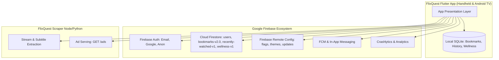
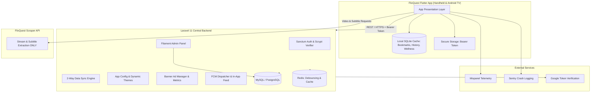

# FlixQuest: Firebase & Scraper-Ads to Laravel Migration PRD
**Document Version:** 1.0.0  
**Target Platform:** Laravel 11.x (PHP 8.3+) & FlixQuest Flutter App (v4.1.0+)  
**Status:** Approved for Implementation  

---

## 1. Executive Summary & Migration Objectives

### 1.1 Problem Statement
FlixQuest currently relies on a fragmented infrastructure:
1. **Firebase Authentication** manages user identity across email/password, anonymous, and Google OAuth.
2. **Cloud Firestore** persists user profiles, bookmarks, continuous viewing progress, and wellness analytics across 5 separate collections/subcollections.
3. **Firebase Remote Config** manages runtime feature toggles, app version update enforcement, logo configurations, and an elaborate seasonal vector-theme catalog.
4. **Firebase Cloud Messaging (FCM)** & **In-App Messaging** trigger background updates and promotional dialogs.
5. **FlixQuest Scraper API** awkwardly hosts promotional banner ads (`GET /ads`), while the toggles and dimensions for those ads are split into Firebase Remote Config (`bannersKey`).
6. **Firebase Crashlytics & Analytics** capture crashes and aggregate streaming time, despite FlixQuest already utilizing Mixpanel for 99% of its core telemetry.

This fragmentation creates vendor lock-in, multi-point network dependencies, high operational complexity, and disjointed business management.

### 1.2 Migration Goals
- **Single Source of Truth**: Consolidate Authentication, User Profiles, Bookmarks, Watch History, Viewing Insights, App Configuration, and Advertisements into a centralized **Laravel 11 REST API** backed by MySQL/PostgreSQL.
- **Pure Video Scraper**: Strip ad-serving logic out of the FlixQuest scraper entirely, keeping it strictly dedicated to stream extraction and subtitle scraping.
- **Zero-Loss User Continuity**:
  - Migrate all existing Firebase Auth users with **lazy password re-hashing** (validating Firebase Scrypt hashes upon first login and seamlessly upgrading them to Laravel Bcrypt).
  - Migrate all Firestore collections into relational tables without losing watch progress, bookmarks, or historical viewing stats.
  - Preserve local SQLite data so users never experience local data loss during the transition.
- **Self-Hosted Administration**: Provide an intuitive web admin dashboard (via **Filament PHP**) to manage feature flags, seasonal themes, banner ads, and user accounts without touching Firebase Console or raw JSON strings.
- **Client Slimming**: Eliminate 7 Firebase dependencies (`cloud_firestore`, `firebase_auth`, `firebase_core`, `firebase_crashlytics`, `firebase_in_app_messaging`, `firebase_remote_config`, `firebase_analytics`), Google Services Gradle plugins, and build-time Crashlytics tasks from the Flutter codebase. `firebase_messaging` is **retained** only to receive FCM push; campaign management moves to Laravel while the client keeps registering its FCM push token. Significantly reduces APK/bundle size and startup overhead.

---

## 2. Architecture: Current vs. Target State

### 2.1 Current Architecture


### 2.2 Target Architecture


---

## 3. Detailed Feature Specifications

### 3.1 Feature 1: Authentication & User Identity

#### Objective
Replace `firebase_auth` with Laravel Sanctum while supporting Email/Password, Google OAuth, and Guest browsing without forcing any user to reset their password.

#### Technical Specifications
- **Token Model**: Laravel Sanctum Personal Access Tokens stored on the client via `flutter_secure_storage`.
- **Firebase Scrypt Compatibility (Lazy Re-hashing)**:
  - Firebase exports user passwords hashed with custom Scrypt (`signer_key`, `salt_separator`, `rounds`, `mem_cost`).
  - When an un-migrated user signs in:
    1. Laravel checks `users.hash_algorithm == 'firebase_scrypt'`.
    2. Laravel hashes the supplied plaintext password with the Firebase Scrypt algorithm using the project's exported `signer_key` and `salt_separator`.
    3. If matched, Laravel updates the password to standard `Hash::make($password)` (Bcrypt or Argon2id), sets `hash_algorithm = 'bcrypt'`, and returns the Sanctum token.
    4. Subsequent logins use standard native Laravel Bcrypt verification.
- **Google Sign-In**:
  - Client retrieves Google `idToken` via `google_sign_in`.
  - Client sends `idToken` to `POST /api/v1/auth/google`.
  - Laravel validates the signature with Google's public keys (`google/apiclient` or `https://oauth2.googleapis.com/tokeninfo?id_token=...`).
  - Laravel matches existing user by email or creates a new user, issuing a Sanctum token.
- **Guest / Anonymous Mode**:
  - FlixQuest already keeps guest data local-only in SQLite.
  - In Laravel, guests do not need server-side auth tokens until they choose to register or log in. When registering, local SQLite bookmarks and watch history are pushed to the new account via 2-way sync.
- **Username Uniqueness & Reservation**:
  - Replaces the Firestore `usernames` collection with a `UNIQUE` index on `users.username`.
  - Endpoint `GET /api/v1/users/check-username?username={val}` verifies availability before form submission.

#### Database Schema: `users`
```sql
CREATE TABLE users (
    id BIGINT UNSIGNED AUTO_INCREMENT PRIMARY KEY,
    firebase_uid VARCHAR(128) UNIQUE NULL,
    name VARCHAR(191) NOT NULL,
    email VARCHAR(191) UNIQUE NOT NULL,
    username VARCHAR(64) UNIQUE NOT NULL,
    password VARCHAR(255) NULL,
    password_salt VARCHAR(255) NULL,
    hash_algorithm VARCHAR(32) DEFAULT 'bcrypt', -- 'firebase_scrypt' or 'bcrypt'
    profile_id INT UNSIGNED DEFAULT 0,
    photo_url VARCHAR(512) NULL,
    provider VARCHAR(32) DEFAULT 'email',         -- 'email', 'google'
    is_verified BOOLEAN DEFAULT FALSE,
    created_at TIMESTAMP NULL,
    updated_at TIMESTAMP NULL
);
CREATE INDEX idx_users_email ON users(email);
CREATE INDEX idx_users_username ON users(username);
CREATE INDEX idx_users_firebase_uid ON users(firebase_uid);
```

#### API Endpoints
| Method | URI | Description | Auth Required |
| :--- | :--- | :--- | :--- |
| `POST` | `/api/v1/auth/register` | Register new account with profileId & username | No |
| `POST` | `/api/v1/auth/login` | Email & password login (supports lazy re-hash) | No |
| `POST` | `/api/v1/auth/google` | Exchange Google idToken for Sanctum token | No |
| `POST` | `/api/v1/auth/forgot-password` | Send password reset email token | No |
| `POST` | `/api/v1/auth/reset-password` | Fulfill password reset with token | No |
| `GET` | `/api/v1/users/check-username` | Verify username availability | No |
| `GET` | `/api/v1/user/profile` | Fetch authenticated user profile | Yes (Bearer) |
| `PUT` | `/api/v1/user/profile` | Update profile (name, username, profileId, photoUrl) | Yes (Bearer) |
| `POST` | `/api/v1/user/change-password` | Update user password | Yes (Bearer) |
| `POST` | `/api/v1/user/change-email` | Update user email address | Yes (Bearer) |
| `POST` | `/api/v1/auth/logout` | Revoke current token | Yes (Bearer) |
| `DELETE`| `/api/v1/user/account` | Delete user and cascade all remote data | Yes (Bearer) |

---

### 3.2 Feature 2: Dynamic App Configuration & Seasonal Themes

#### Objective
Replace `firebase_remote_config` with a lightweight, cached JSON configuration endpoint (`/api/v1/config/bootstrap`) and an admin management interface in Laravel.

#### Technical Specifications
- **Consolidation**: Deliver all runtime switches, version gates, seasonal themes, and API fallbacks in a single HTTP request during app boot.
- **Client Cache & Fallback**:
  - Client caches the payload in `SharedPreferencesSingleton`.
  - HTTP `If-None-Match` (ETag) supported so repeated launches consume zero unnecessary bandwidth.
- **Occasional Theme Catalog (Schema v2)**:
  - Preserves the exact JSON specification defined in [`docs/firebase_remote_config.md`](file:///Users/beamlak/Documents/flutter_projects/personal/fq/flixquest/docs/firebase_remote_config.md).
  - Handles theme window boundaries (`starts_at`, `ends_at`), priority, vector particle effects (`snow`, `adey_flowers`, `fireworks`, `bats`, `hearts`, `candy_eggs`, `stars`, `sparkles`, `confetti`), and color palettes.

#### Database Schema: `app_configurations` & `occasional_themes`
```sql
CREATE TABLE app_configurations (
    `key` VARCHAR(64) PRIMARY KEY,
    `value` TEXT NOT NULL,
    `type` VARCHAR(32) DEFAULT 'string', -- 'string', 'boolean', 'integer', 'json'
    `description` VARCHAR(255) NULL,
    `updated_at` TIMESTAMP DEFAULT CURRENT_TIMESTAMP ON UPDATE CURRENT_TIMESTAMP
);

CREATE TABLE occasional_themes (
    `id` VARCHAR(64) PRIMARY KEY,
    `display_name` VARCHAR(128) NOT NULL,
    `description` TEXT NULL,
    `is_enabled` BOOLEAN DEFAULT TRUE,
    `user_selectable` BOOLEAN DEFAULT TRUE,
    `priority` INT DEFAULT 0,
    `logo_url` VARCHAR(512) NULL,
    `primary_color` VARCHAR(16) NULL,
    `secondary_color` VARCHAR(16) NULL,
    `tertiary_color` VARCHAR(16) NULL,
    `light_bg_color` VARCHAR(16) NULL,
    `dark_bg_color` VARCHAR(16) NULL,
    `starts_at` TIMESTAMP NULL,
    `ends_at` TIMESTAMP NULL,
    `effect_type` VARCHAR(32) DEFAULT 'none',
    `effect_density` INT DEFAULT 28,
    `effect_speed` FLOAT DEFAULT 1.0,
    `effect_opacity` FLOAT DEFAULT 0.65,
    `effect_colors` JSON NULL,
    `created_at` TIMESTAMP NULL,
    `updated_at` TIMESTAMP NULL
);
```

#### API Endpoint: `GET /api/v1/config/bootstrap`
**Response Contract:**
```json
{
  "success": true,
  "data": {
    "features": {
      "enable_stream": true,
      "enable_download": true,
      "enable_live_tv": true,
      "enable_ott": true
    },
    "branding": {
      "app_logo_url": "https://cdn.flixquest.app/logos/brand.png",
      "cinemax_logo": "default"
    },
    "updates": {
      "forced_update": false,
      "latest_version": "4.1.0",
      "latest_build_number": 4,
      "min_build_number": 1,
      "app_download_url": "https://flixquest.app/download",
      "change_log": "Initial Laravel migration release."
    },
    "network": {
      "flixquest_api_instances": [
        "https://scraper-1.flixquest.app",
        "https://scraper-2.flixquest.app"
      ],
      "flixquest_api_url_v2": "https://scraper-1.flixquest.app",
      "tmdb_api_key": "0f0a1b2c...", 
      "tmdb_proxy": "https://proxy.flixquest.app/tmdb"
    },
    "ads": {
      "banner_ad_network": "native",
      "unity_game_id_android": "5445375",
      "unity_banner_placement_id": "Banner_Android",
      "unity_test_mode": false
    },
    "occasional_theme": {
      "schema_version": 2,
      "enabled": true,
      "allow_user_selection": true,
      "effects_enabled": true,
      "allow_user_effects_toggle": true,
      "default_theme_id": "",
      "themes": [ ... ]
    }
  }
}
```

**Note — full Remote Config coverage:** the `bootstrap` payload must map **every** key the client currently reads from Firebase Remote Config (`lib/services/app_remote_config.dart`): `enable_stream`, `enable_download`, `enable_live_tv`, `enable_ott` (legacy, only honored when `enable_live_tv` is absent), `occasional_theme`, `app_logo_url`, `cinemax_logo`, `tmdb_api_key`, `tmdb_proxy`, `flixquest_api_instances`, `flixquest_api_url_v2`, `banner_ad_network`, `unity_game_id_android`, `unity_banner_placement_id`, `unity_test_mode`, and `banners`. The example above covers all of them. `banner_ad_network` in particular drives the native/Unity/none switching inside `RemoteHostedAdsBanner` and must be delivered even after `GET /ads` moves to Laravel.

**Note — theme schema flattening:** the `occasional_themes` relational schema above flattens the `effect` object from [`docs/firebase_remote_config.md`](file:///Users/beamlak/Documents/flutter_projects/personal/fq/flixquest/docs/firebase_remote_config.md) into `effect_type`/`effect_density`/`effect_speed`/`effect_opacity`/`effect_colors`. The import layer must preserve the full v2 semantics the client depends on:
- Per-theme `effect.enabled` (the flattened schema has no `effect_enabled` column — add one or encode it in `effect_type = 'none'`).
- Custom themes defined via the `colors` array (two distinct hex colors from which the app derives tertiary/background colors) in addition to `primary_color`/`secondary_color`.
- Built-in theme aliases (`xmas`, `ethiopian-new-year`, `enkutatash`, `valentine`, etc.) and preset fallbacks for invalid entries.
- Overlap resolution rules (active window, user selection, `default_theme_id`, priority, alphabetical tiebreak).

---

### 3.3 Feature 3: Ads & Monetization Engine

#### Objective
Extract all promotional ad-serving logic out of the FlixQuest scraper and Firebase Remote Config, consolidating it into a Laravel-powered ad delivery engine with placement targeting, scheduling, and conversion metrics.

#### Technical Specifications
- **Scraper Decoupling**: Delete `GET /ads` from the scraper codebase. Remove `ScraperApi.getAds()` from Flutter.
- **Unified Rules**: Dimensions, shapes, and placement rules are stored directly with the ad record in Laravel—eliminating the need to check Remote Config `bannersKey` separately.
- **Targeted Placements**: The 19 active FlixQuest placements are queried via `GET /api/v1/ads?placement={name}`. These match the `placement:` strings currently passed to `RemoteHostedAdsBanner` across `lib/`:
  - **Movies (handheld):** `home_movies`, `movie_list`, `movie_detail`, `genre_movies`, `discover_movies`, `streaming_movies`, `collection_detail`
  - **TV (handheld):** `home_tv`, `tv_list`, `tv_detail`, `season_detail`, `episode_detail`, `genre_tv`, `discover_tv`, `streaming_tv`
  - **Shared:** `bookmarks`, `downloads`, `live_tv`, `person_detail`
  - Note: `bookmarks` and `downloads` keep the current placement names even though the UI labels them Watchlist/Downloads; `season_detail` (not `seasons_detail`) is the live name.
- **Impression & Click Telemetry**:
  - `POST /api/v1/ads/{id}/impression`
  - `POST /api/v1/ads/{id}/click`
  - Allows performance monitoring in the Laravel Filament admin panel.

#### Database Schema: `banner_ads`
```sql
CREATE TABLE banner_ads (
    id BIGINT UNSIGNED AUTO_INCREMENT PRIMARY KEY,
    `key` VARCHAR(64) UNIQUE NOT NULL,
    `name` VARCHAR(128) NOT NULL,
    image_url VARCHAR(512) NOT NULL,
    target_url VARCHAR(512) NOT NULL,
    alt_text VARCHAR(255) NULL,
    shape ENUM('rectangle', 'square', 'portrait', 'wide') DEFAULT 'rectangle',
    aspect_ratio FLOAT DEFAULT 2.2,
    custom_width DOUBLE NULL,
    custom_height DOUBLE NULL,
    placements JSON NOT NULL, -- Array of string placements or empty for all
    is_active BOOLEAN DEFAULT TRUE,
    priority INT DEFAULT 0,
    starts_at TIMESTAMP NULL,
    ends_at TIMESTAMP NULL,
    impressions_count BIGINT UNSIGNED DEFAULT 0,
    clicks_count BIGINT UNSIGNED DEFAULT 0,
    created_at TIMESTAMP NULL,
    updated_at TIMESTAMP NULL
);
CREATE INDEX idx_banner_ads_active ON banner_ads(is_active, priority);
```

#### API Endpoints
| Method | URI | Description |
| :--- | :--- | :--- |
| `GET` | `/api/v1/ads` | Fetch active ads (accepts `?placement={name}`) |
| `POST` | `/api/v1/ads/{id}/impression` | Increment ad impression count |
| `POST` | `/api/v1/ads/{id}/click` | Increment ad click count |

**Response Contract (`GET /api/v1/ads?placement=movie_detail`):**
```json
{
  "success": true,
  "ads": [
    {
      "key": "nordvpn_summer",
      "id": "14",
      "name": "NordVPN Summer Campaign",
      "imageUrl": "https://cdn.flixquest.app/ads/nordvpn.png",
      "targetUrl": "https://nordvpn.com/flixquest",
      "altText": "NordVPN discount banner",
      "shape": "rectangle",
      "aspectRatio": 2.2,
      "width": null,
      "height": null,
      "placements": ["home_movies", "movie_detail"]
    }
  ]
}
```

---

### 3.4 Feature 4: Two-Way Data Synchronization

FlixQuest uses local SQLite on the device as the primary cache and syncs with the cloud. The migration replaces Firestore real-time queries with efficient, batch-oriented REST synchronization endpoints.

#### 4.1 Bookmarks Synchronization (`user_bookmarks`)
- **Current Logic**: Union merge by TMDB `id` between local SQLite and cloud array.
- **Laravel Target**:
  - `user_bookmarks` table storing individual movie and TV show bookmarks.
  - Endpoints allow pushing local diffs and pulling full cloud state.

**Database Schema:**
```sql
CREATE TABLE user_bookmarks (
    id BIGINT UNSIGNED AUTO_INCREMENT PRIMARY KEY,
    user_id BIGINT UNSIGNED NOT NULL,
    media_type ENUM('movie', 'tv') NOT NULL,
    media_id INT UNSIGNED NOT NULL,
    title VARCHAR(255) NOT NULL,
    poster_path VARCHAR(255) NULL,
    backdrop_path VARCHAR(255) NULL,
    vote_average FLOAT NULL,
    release_date VARCHAR(32) NULL,
    raw_payload JSON NOT NULL,
    created_at TIMESTAMP NULL,
    updated_at TIMESTAMP NULL,
    CONSTRAINT fk_bookmarks_user FOREIGN KEY (user_id) REFERENCES users(id) ON DELETE CASCADE,
    UNIQUE KEY uq_user_media (user_id, media_type, media_id)
);
```

**Sync Endpoint:**
- `POST /api/v1/sync/bookmarks`
  - Request: `{ "movies": [MovieMap...], "tvShows": [TVMap...] }`
  - Process: Laravel performs an `UPSERT` on all incoming items, queries all existing bookmarks for the user, and returns the complete merged collection.
  - Response: `{ "success": true, "movies": [...], "tvShows": [...] }`

---

#### 4.2 Recently Watched & Progress Synchronization
- **Current Logic**: Last-write-wins merge comparing `updatedAtUtc` with 90-day tombstone retention via `deletedAtUtc`.
- **Laravel Target**:
  - Tables: `recently_watched_movies` and `recently_watched_episodes`.
  - Batch upload endpoint debounced every 5 seconds on the client and flushed on lifecycle backgrounding.

**Database Schema:**
```sql
CREATE TABLE recently_watched_movies (
    id BIGINT UNSIGNED AUTO_INCREMENT PRIMARY KEY,
    user_id BIGINT UNSIGNED NOT NULL,
    movie_id INT UNSIGNED NOT NULL,
    title VARCHAR(255) NULL,
    release_year INT NULL,
    elapsed INT NOT NULL,
    remaining INT NOT NULL,
    date_watched VARCHAR(64) NULL,
    poster_path VARCHAR(255) NULL,
    backdrop_path VARCHAR(255) NULL,
    updated_at_utc BIGINT NOT NULL,
    deleted_at_utc BIGINT NULL,
    created_at TIMESTAMP NULL,
    updated_at TIMESTAMP NULL,
    CONSTRAINT fk_rw_movies_user FOREIGN KEY (user_id) REFERENCES users(id) ON DELETE CASCADE,
    UNIQUE KEY uq_user_movie (user_id, movie_id)
);

CREATE TABLE recently_watched_episodes (
    id BIGINT UNSIGNED AUTO_INCREMENT PRIMARY KEY,
    user_id BIGINT UNSIGNED NOT NULL,
    episode_id INT UNSIGNED NOT NULL,
    series_id INT UNSIGNED NOT NULL,
    series_name VARCHAR(255) NULL,
    episode_name VARCHAR(255) NULL,
    episode_num INT NOT NULL,
    season_num INT NOT NULL,
    elapsed INT NOT NULL,
    remaining INT NOT NULL,
    date_added VARCHAR(64) NULL,
    poster_path VARCHAR(255) NULL,
    backdrop_path VARCHAR(255) NULL,
    updated_at_utc BIGINT NOT NULL,
    deleted_at_utc BIGINT NULL,
    created_at TIMESTAMP NULL,
    updated_at TIMESTAMP NULL,
    CONSTRAINT fk_rw_episodes_user FOREIGN KEY (user_id) REFERENCES users(id) ON DELETE CASCADE,
    UNIQUE KEY uq_user_episode (user_id, episode_id)
);
CREATE INDEX idx_rw_movies_sync ON recently_watched_movies(user_id, updated_at_utc);
CREATE INDEX idx_rw_episodes_sync ON recently_watched_episodes(user_id, updated_at_utc);
```

**Sync Endpoint:**
- `POST /api/v1/sync/recently-watched`
  - Request: `{ "since_utc": 1725000000000, "movies": [...], "episodes": [...] }`
  - Process: Laravel applies incoming writes where `incoming.updated_at_utc > existing.updated_at_utc`, prunes tombstones older than 90 days, and returns any rows updated since `since_utc`.

---

#### 4.3 Wellness & Viewing Insights Synchronization
- **Current Logic**: Granular viewing sessions under `wellness-v1/{uid}/sessions` and daily aggregates under `wellness-v1/{uid}/daily`.
- **Laravel Target**:
  - Tables: `wellness_sessions` and `wellness_daily_summaries`.

**Database Schema:**
```sql
CREATE TABLE wellness_sessions (
    id VARCHAR(64) PRIMARY KEY, -- Client UUID
    user_id BIGINT UNSIGNED NOT NULL,
    device_id VARCHAR(64) NOT NULL,
    media_type VARCHAR(32) NOT NULL,
    playback_source VARCHAR(32) NOT NULL,
    content_id VARCHAR(64) NOT NULL,
    series_id VARCHAR(64) NULL,
    title VARCHAR(255) NOT NULL,
    subtitle VARCHAR(255) NULL,
    season_number INT NULL,
    episode_number INT NULL,
    started_at_utc BIGINT NOT NULL,
    ended_at_utc BIGINT NOT NULL,
    timezone_offset_minutes INT NOT NULL,
    watched_ms BIGINT NOT NULL,
    duration_ms BIGINT NOT NULL,
    progress_end_ms BIGINT NOT NULL,
    completed BOOLEAN DEFAULT FALSE,
    segments JSON NOT NULL,
    poster_path VARCHAR(255) NULL,
    backdrop_path VARCHAR(255) NULL,
    release_year INT NULL,
    provider VARCHAR(64) NULL,
    genres JSON NULL,
    languages JSON NULL,
    countries JSON NULL,
    updated_at_utc BIGINT NOT NULL,
    deleted_at_utc BIGINT NULL,
    created_at TIMESTAMP NULL,
    updated_at TIMESTAMP NULL,
    CONSTRAINT fk_wellness_user FOREIGN KEY (user_id) REFERENCES users(id) ON DELETE CASCADE
);

CREATE TABLE wellness_daily_summaries (
    id BIGINT UNSIGNED AUTO_INCREMENT PRIMARY KEY,
    user_id BIGINT UNSIGNED NOT NULL,
    local_day VARCHAR(16) NOT NULL, -- 'YYYY-MM-DD'
    timezone_offset_minutes INT NOT NULL,
    watched_ms BIGINT NOT NULL,
    movie_ms BIGINT NOT NULL,
    episode_ms BIGINT NOT NULL,
    live_ms BIGINT NOT NULL,
    completed_movies INT NOT NULL,
    completed_episodes INT NOT NULL,
    session_count INT NOT NULL,
    updated_at_utc BIGINT NOT NULL,
    created_at TIMESTAMP NULL,
    updated_at TIMESTAMP NULL,
    CONSTRAINT fk_wellness_daily_user FOREIGN KEY (user_id) REFERENCES users(id) ON DELETE CASCADE,
    UNIQUE KEY uq_user_day (user_id, local_day)
);
```

**Sync Endpoint:**
- `POST /api/v1/sync/wellness`
  - Request: `{ "since_utc": 1725000000000, "sessions": [...], "daily": [...] }`
  - Process: Laravel upserts pending sessions and daily summaries where `incoming.updated_at_utc > existing.updated_at_utc`, prunes tombstones older than 90 days, and returns every session/daily row changed since `since_utc` (so the client can pull other devices' writes without re-downloading the full collection).
  - Pagination: responses support `?cursor={id}` + `?limit={n}` (default 450, mirroring the client's existing 450-row batch ceiling) because a long-running user's session history can exceed a single response.

---

### 3.5 Feature 5: Notifications & Error Telemetry

#### Push Notifications
- Flutter registers device FCM push token with Laravel: `POST /api/v1/devices/register`.
- Laravel handles notification campaigns via Laravel Notification Channels (`laravel-notification-channels/fcm` or direct Google HTTP v1 API).
- Replaces Firebase In-App Messaging by adding an announcement endpoint: `GET /api/v1/messages/active`.

**Database Schema: `user_devices` & `announcements`**
```sql
CREATE TABLE user_devices (
    id BIGINT UNSIGNED AUTO_INCREMENT PRIMARY KEY,
    user_id BIGINT UNSIGNED NOT NULL,
    fcm_token VARCHAR(4096) NOT NULL,
    platform VARCHAR(16) NOT NULL,       -- 'android', 'ios'
    app_version VARCHAR(32) NULL,
    last_active_at TIMESTAMP DEFAULT CURRENT_TIMESTAMP ON UPDATE CURRENT_TIMESTAMP,
    created_at TIMESTAMP NULL,
    updated_at TIMESTAMP NULL,
    CONSTRAINT fk_devices_user FOREIGN KEY (user_id) REFERENCES users(id) ON DELETE CASCADE,
    UNIQUE KEY uq_user_token (user_id, fcm_token)
);

CREATE TABLE announcements (
    id BIGINT UNSIGNED AUTO_INCREMENT PRIMARY KEY,
    title VARCHAR(255) NOT NULL,
    body TEXT NULL,
    image_url VARCHAR(512) NULL,
    action_url VARCHAR(512) NULL,
    button_text VARCHAR(64) NULL,
    display_type ENUM('modal', 'bottom_sheet', 'banner') DEFAULT 'modal',
    is_active BOOLEAN DEFAULT TRUE,
    starts_at TIMESTAMP NULL,
    ends_at TIMESTAMP NULL,
    created_at TIMESTAMP NULL,
    updated_at TIMESTAMP NULL
);
```

**Endpoint Contracts:**
- `POST /api/v1/devices/register` (Bearer)
  - Request: `{ "fcm_token": "...", "platform": "android", "app_version": "4.2.0" }`
  - Process: upsert token on the authenticated user; on `DELETE /api/v1/user/account` cascade all device rows.
- `GET /api/v1/messages/active` (Bearer)
  - Response: `{ "success": true, "messages": [ { "id": 3, "title": "...", "body": "...", "image_url": "...", "action_url": "...", "button_text": "...", "display_type": "modal" } ] }`
  - Process: returns `announcements` where `is_active = true` and `starts_at <= now <= ends_at`, ordered by start time descending. The Flutter `InAppMessagingService` (`lib/services/in_app_messaging_service.dart`) is refactored to poll this endpoint instead of parsing FCM `data` payloads, keeping the existing `InAppMessagePayload` model shape (`title`, `body`, `image_url`, `action_url`, `button_text`, `display_type`).

#### Crash & Error Telemetry
- Replace Firebase Crashlytics in [`main.dart`](file:///Users/beamlak/Documents/flutter_projects/personal/fq/flixquest/lib/main.dart) with **Sentry Flutter** (`sentry_flutter`) or a lightweight error ingestion endpoint in Laravel:
  - `POST /api/v1/telemetry/errors`
  - Fields: `error_message`, `stack_trace`, `app_version`, `device_info`, `occurred_at`.
- Forward `updateAndLogTotalStreamingDuration` from [`function.dart`](file:///Users/beamlak/Documents/flutter_projects/personal/fq/flixquest/lib/functions/function.dart) to Mixpanel (`analytics.trackStreamingDuration(seconds)`).

---

## 4. Phase-by-Phase Implementation Plan

### Phase 1: Laravel Backend Foundation & Schema
- **Milestone 1.1**: Initialize Laravel 11 project with PostgreSQL/MySQL, Redis, and Laravel Sanctum.
- **Milestone 1.2**: Execute migrations for `users`, `app_configurations`, `occasional_themes`, `banner_ads`, `user_bookmarks`, `recently_watched_*`, and `wellness_*`.
- **Milestone 1.3**: Implement Firebase Scrypt Hasher (`FirebaseScryptHasher.php`) with lazy re-hashing in the custom authentication pipeline.
- **Milestone 1.4**: Build Auth controllers (`AuthController`, `GoogleAuthController`, `ProfileController`).
- **Milestone 1.5**: Build `ConfigController` (`/api/v1/config/bootstrap`) and `BannerAdController` (`/api/v1/ads`).
- **Milestone 1.6**: Set up **Filament PHP** dashboard for visual management of users, themes, feature flags, and advertisements.

### Phase 2: Scraper Cleanup
- **Milestone 2.1**: Remove the `/ads` route and all associated banner JSON files or database models from the FlixQuest scraper repository.
- **Milestone 2.2**: Update scraper documentation and ensure the scraper service is purely an extraction engine.

### Phase 3: Historical Data Migration (Firebase $\rightarrow$ Laravel)
- **Milestone 3.1**: Export all Firebase Auth users using the Firebase CLI:
  ```bash
  firebase auth:export firebase_users.json --format=json
  ```
- **Milestone 3.2**: Retrieve Firebase project password hash parameters from Firebase Console:
  - `signer_key`, `salt_separator`, `rounds`, `mem_cost`. Store these in Laravel `.env`.
- **Milestone 3.3**: Write and test an Artisan migration command: `php artisan flixquest:import-firebase`:
  - Ingest `firebase_users.json` into `users` table with `hash_algorithm = 'firebase_scrypt'`.
  - Connect to Firestore via `google/cloud-firestore` or exported JSON dumps to populate `user_bookmarks`, `recently_watched_movies`, `recently_watched_episodes`, `wellness_sessions`, and `wellness_daily_summaries`.
- **Milestone 3.4**: Run data validation scripts comparing Firestore record counts with Laravel table counts.

### Phase 4: Flutter Client Refactoring
- **Milestone 4.1**: Build `LaravelApiClient` with automatic token attachment, 401 handling, and offline request retry.
- **Milestone 4.2**: Refactor [`FlixQuestAuthService`](file:///Users/beamlak/Documents/flutter_projects/personal/fq/flixquest/lib/services/flixquest_auth_service.dart) and [`AuthSessionController`](file:///Users/beamlak/Documents/flutter_projects/personal/fq/flixquest/lib/services/auth_session_controller.dart) to authenticate via Laravel. Store Bearer token in `flutter_secure_storage`.
- **Milestone 4.3**: Refactor [`AppRemoteConfig`](file:///Users/beamlak/Documents/flutter_projects/personal/fq/flixquest/lib/services/app_remote_config.dart) into `AppConfigService`, calling `/api/v1/config/bootstrap`.
- **Milestone 4.4**: Update [`RemoteHostedAdsBanner`](file:///Users/beamlak/Documents/flutter_projects/personal/fq/flixquest/lib/widgets/hosted_ads_banner.dart) to load ads from `LaravelApiClient.getAds(placement)` across all 12 placements. Remove `getAds()` from [`scraper_api.dart`](file:///Users/beamlak/Documents/flutter_projects/personal/fq/flixquest/lib/video_providers/scraper_api.dart).
- **Milestone 4.5**: Refactor [`BookmarkSyncService`](file:///Users/beamlak/Documents/flutter_projects/personal/fq/flixquest/lib/services/bookmark_sync_service.dart), [`RecentlyWatchedSyncService`](file:///Users/beamlak/Documents/flutter_projects/personal/fq/flixquest/lib/services/recently_watched_sync_service.dart), and [`WellnessSyncService`](file:///Users/beamlak/Documents/flutter_projects/personal/fq/flixquest/lib/services/wellness_sync_service.dart) to call their respective Laravel REST sync endpoints.
- **Milestone 4.6**: Remove `FirebaseCrashlytics` from [`main.dart`](file:///Users/beamlak/Documents/flutter_projects/personal/fq/flixquest/lib/main.dart). Direct `total_streaming_duration` to Mixpanel.

### Phase 5: Dependency & Build Removal
- **Milestone 5.1**: Remove Firebase packages from [`pubspec.yaml`](file:///Users/beamlak/Documents/flutter_projects/personal/fq/flixquest/pubspec.yaml):
  - `cloud_firestore`, `firebase_auth`, `firebase_core`, `firebase_crashlytics`, `firebase_in_app_messaging`, `firebase_remote_config`, `firebase_analytics` (7 total; direct streaming-time telemetry to Mixpanel per Milestone 4.6).
  - **Retain** `firebase_messaging` — it is still required to receive FCM push and to expose the client token registered at `/api/v1/devices/register`.
- **Milestone 5.2**: Clean native Android build files:
  - Remove `google-services` and `firebase-crashlytics` classpath dependencies from [`android/build.gradle`](file:///Users/beamlak/Documents/flutter_projects/personal/fq/flixquest/android/build.gradle).
  - Remove plugins from [`android/app/build.gradle`](file:///Users/beamlak/Documents/flutter_projects/personal/fq/flixquest/android/app/build.gradle).
  - Delete [`android/app/google-services.json`](file:///Users/beamlak/Documents/flutter_projects/personal/fq/flixquest/android/app/google-services.json).
  - Clean Firebase ProGuard rules in [`android/app/proguard-rules.pro`](file:///Users/beamlak/Documents/flutter_projects/personal/fq/flixquest/android/app/proguard-rules.pro).

### Phase 6: Quality Assurance, Staging & Cutover
- **Milestone 6.1**: Run automated integration tests covering:
  - Email/Password login with a migrated Firebase Scrypt hash $\rightarrow$ verifying automatic upgrade to Bcrypt.
  - Google Sign-In with an existing user.
  - 2-way merge of bookmarks and watch progress across two simultaneous devices.
  - Offline startup and configuration caching.
- **Milestone 6.2**: Execute a rehearsal data migration on a staging database.
- **Milestone 6.3**: Final data migration cutover window:
  - Put legacy Firebase rules in read-only mode.
  - Run final incremental export & import to Laravel.
  - Release app update v4.2.0 to users.

---

## 5. Risk Assessment & Mitigation Matrix

| Risk | Severity | Impact | Mitigation Strategy |
| :--- | :--- | :--- | :--- |
| **Password Verification Failure** | Critical | Users unable to sign into existing accounts | Implement a unit-tested Scrypt validator verified against real exported Firebase hashes. If validation fails, provide a streamlined one-click password reset fallback. |
| **Data Sync Race Conditions** | High | Progress overwritten if multiple devices update simultaneously | Maintain strict last-write-wins logic using `updated_at_utc`. Database transactions lock user rows during merge operations. |
| **Device Clock Skew** | Medium | A device with an incorrect clock writes `updated_at_utc` far in the future (or past), permanently winning (or losing) conflicts | Laravel clamps incoming `updated_at_utc` values to a bounded window around server time (±24h) before conflict resolution and tombstone pruning; values outside the window are rejected with a retryable `422` so the client refreshes its clock. Tombstone pruning always uses server time, never client-supplied values. |
| **App Offline Failure on Launch** | High | Blank screens if Laravel API is unreachable on startup | Retain existing `SharedPreferences` cache for app configuration, theme catalog, and feature toggles. Feature toggles default to `true` on network failure. |
| **Ad Delivery Latency** | Medium | Flickering or delayed banner presentation | Laravel caches `/api/v1/ads` in Redis with cache tags. Flutter app caches ad graphics using existing `_adImageCache` (`flutter_cache_manager`). |
| **Google Sign-In Token Mismatch** | Medium | Google users prompted with account creation error | Match Google accounts by verified email in Laravel if the user originally signed up via email/password. |

---

## 6. Success Metrics & KPIs
1. **Zero Support Tickets for Password Resets**: 100% of migrated email/password users log in seamlessly on their first attempt.
2. **Data Parity**: 100% match between Firestore historical records and migrated relational tables.
3. **App Startup Latency**: Reduction in app initialization time by at least **250ms** due to the removal of `Firebase.initializeApp()` and Remote Config network listeners.
4. **App Binary Size**: Reduction of Android APK / App Bundle size by **~3.5 MB** following the removal of Firebase native binaries and SDKs.
5. **Operational Efficiency**: 100% of banner ads, seasonal themes, and feature toggles manageable through the Laravel Filament admin panel without code deploys.
